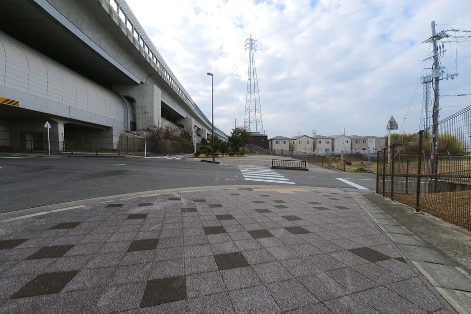

## North Kawachi Cycle Path

Kitakawachi Cycle Line is one of Osaka Prefecture's large-scale bicycle paths.
The Kitakawachi Cycle Line is a 45.5 km cycle path that starts from Tsurumi-ryokuchi and circles the Osaka Central Loop Line, the left bank of the Yodogawa River, the Hoya River, and the Daini-Keihan Road.
Together with the Minami-Kawachi Cycle Line, Kita-Osaka Cycle Line, and Naniwa Bike Path, it is one of Osaka's representative bicycle paths.

## Map

{{< mbox json="geodata.json" center="{\"lng\": 135.641885, \"lat\": 34.777 }" zoom=10.5 style="">}}

## Starting from Tsurumi-ryokuchi Park

It is hard to get motivated to ride a bicycle in the cold winter. Fortunately this winter has been warm, so on a fine morning, I parked my car at Tsurumi-ryokuchi park and started cycling.

I started from the central entrance of Tsurumi-ryokuchi park.

The roadway on Hanahaku-dori is wide, but cars are also driving fast, so I ride on the sidewalk. There are some white lines on the sidewalk, so I guess the sidewalk is the regular route.

Soon you will reach the intersection under the Kadoma JCT overpass. Turn left here.

## Under Kinki Expressway, Kadoma to Moriguchi

From the Kadoma IC, I went north along the highway. The red line seems a bicycle path.

While this road is a bicycle road, it is not bike-friendry. First you will encount the Matsuo-cho intersection, where cars go straight on the overpass. Bicycles are not allowed to go straight. There are no sidewalks or pedestrian crossings.

There is an underpass to cross the road. The entrance is like this.

In the underpass, I had to get off the bike to walk on.

The underground passage is quite long, and there are four exits, so I lost my sense of direction and end up at the wrong exit.

After crossing the underpass, the next obstacle is Kadoma Station. cars go straight on the elevated road, but bicycles go down the road, on which you can not go through the station.

I arrived at the the station. Where shold I go?

I went up the stairs.

Passing in front of the station's ticket gate, there are a lot of people, so I am embarrassed to be dressed as a road bike rider.

Going down the stairs to north. From here, I rode on the right side of the roadway.

The Cycle Line road seems to be bicycle-friendly, but actually it is not good to ride, as it intersects frequently with narrow roads that has traffic lights.

While cycling with a view of the monorail above, I reached the Dainichi area.

You can not go straight throgh Dainichi station. I had to enter the underpass.

After crossing Dainichi Station, I was almost at the Yodogawa River.

The bank of the Yodogawa River comes into view.

From here, you can enter the Yodogawa River.

At the entrance to the Yodogawa River, there is a signboard of the Kitakawachi Cycle Line. Up to this point, the road was not good to ride the bicycle on, but from here, you can feel confortable riding.

The monorail overhead crosses the Yodogawa River.

## From the left bank of the Yodogawa River to the Hotani River

After a short rest, I took the road along the Yodogawa River.

Although the road along the Yodogawa River has occasional bicycle stops, you can ride at a comfortable speed.

The scenery looks same along the bank, but it is nice to have a clear view.

The road runs on the bank, but the Yodogawa Shinbashi bridge did not allow me to go straight on the bank, so I had to go down the road.

The road under the bank is a wide road. After it rains, the road is sometimes puddled with water, but this was not the case today.

I usually go up on the bank when crossing Hirakata Ohashi Bridge, but this time I came up with the idea of taking the path under the bank.

It looks I should go on the bank. My bike rattled on the brick pavement.

Then a gravel road appeared ahead. It was a complete mistake to take the road.

I decided to go up the slope at this point.

We are almost to the Hodani River.

At this point, join the Hodani River and turn right along the river.

## Along the Hotani River

Following the narrow riverside road to Makino Station.

Arrived at Makino Station.

The load became smooth and easier to ride a bicycle.

On the way, there was a small flower garden on the right, and even in winter, there were some flowers blooming. I took a short break to admire them.

The road soon comes to an end at the T-junction with National Route 1.

After crossing Route 1, I entered Yamada Pond Park along the cycle line. There were many ducks and other water birds in Yamada Pond.

I left Yamada Pond Park and returned to the Kitakawachi Cycle Line.

The road is narrow and there are many cars on the road, so sometimes I had to ride on the sidewalk. The sidewalks are wide, but it is hard to ride with the narrow tires of a road bike. I later realized that there was a bicycle path on the other side of the Hoya River. No wonder it was difficult to ride.

Fujisaka Station came into view.

Climbing up the hill, I crossed the Hoya River and headed toward the Daini-Keihan Road.

The correct way is to go straight up here, but at first I mistakenly took the left. However, this road itself is off the cycle line, and it seems that the Kitakawachi Cycle Line has a parallel bicycle path on the right side across the river.

Anyway, I went off from the Hodani River and headed toward the Daini-Keihan Road.

Here I found a Lawson. Since I hadn't found any convenience stores until that time, I took off the bike to get some bread and juice for lunch.

The Daini-Keihan Road can be seen shortly after the Lawson.

When I reached Daini-Keihan Road, there was an entrance that looks like a bicycle path, and there is even a signboard. The boundary line between the bike path and the sidewalk is also drawn, so it looks good cycling road!

We have come a long way from Tsurumi-ryokuchi. All that remains is to continue straight ahead.

## Under Daini Keihan Road

The expectation of a "fine bicycle path" was soon betrayed. There is a path for bicycles, but the road surface is uneven like a gravel road.

The yellow pavement material seems to be easily peeled off, making pebbles on the surface, which causes resistance and makes it tiring to ride at high speed.

There were many intersections, so I had to stop frequently.

I continued along the rickety road. My physical strength is also being sapped.

I crossed a railroad on the way which cross the tracks of the Gakkentoshi Line.

The Kitakawachi Cycle Line runs parallel to the Daini-Keihan Road on both sides. This time I took the right side. Looking at Google Maps, the left side of the road has a slope that goes up and over the tracks, so the left side have been easier to go.

The road surface is still in poor condition, but there are some places where the pavement is new, that have less road resistance. I think all along the road used to be like this when the Kitakawachi Cycle Line was constructed.

There is one more crossing over the railroad tracks. The road dead-ends at this point.

I wondered what was going on, then I found a stairway to the overpass on my left.

Now nothing is left but going toward Kadoma JCT. The left side of the road abobe is an elevated highway, and the right side is residential houses, so there is nothing interesting to see.

Another new paved road. Lucky me.

Approaching Kadoma JCT.

This is the end of the gravel road.

Since bicycles cannot cross the intersection under Kadoma JCT, I had to go up to the overpass.

The overhead highway is close by!

All that remains is to go back to Tsurumi Ryokuchi.

At last I had arrived at Tsurumi Ryokuchi Park.

The goal is in front of a flowerbed with delicate cabbage-like flowers.

Even though it was only 45.5 km long, the last part of the cycling was hard for me because I was not able to ride my bicycle.

## Summary

The Kitakawachi Cycle Line is not easy to ride except for the bank of the Yodogawa River, nor does it have any highlights. It was not as interesing as expected. You can park your car at Tsurumi-ryokuchi and Fukakita-ryokuchi. I think the South Kawachi Cycle Line was more fun to ride.
