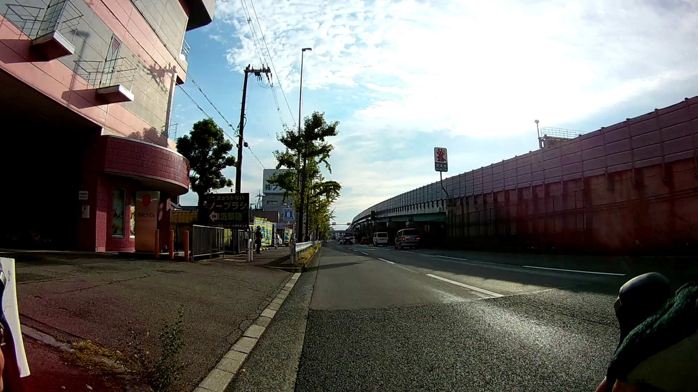

---
categories:
  - bike
  - cycle path
title: "North Osaka Cycle Path"
date: 2021-05-05T14:01:40+09:00
lastmod: 2025-08-03T08:08:08+09:00
description: If you are thinking to enjoy cycling in Osaka, Japan, North Osaka Cycle Path would be one of choices. North Osaka Cycle Path begins at Osaka city hall and reaches Expo'70 Commemoriative Park.
draft: false
tags:
  - cycling
  - pottering
  - road bike
  - Madone2.1
  - Osaka
  - North Osaka Cycle line
  - Cycle line
keywords: "Cycling, Osaka, North Osaka Cycle Path, Yodo River, Expo'70 Park"
featured_image: 'images/DSCF0485.JPG'
js: "js/mbox.ts"
---

If you are thinking to enjoy cycling in Osaka, Japan, There would be several choices listed below.

* North Kawachi Cycle Path
* South Kawachi Cycle Path
* Naniwa Cycle Path
* North Osaka Cycle Path

North Osaka Cycle Path begins at Osaka city hall. It reaches Expo'70 Commemoriative Park.

Although people usually go from south to north, I took opposite direction.

## North Osaka Cycle Path - Map

{{< mbox json="track1.json" center="{ \"lng\": \"135.54\", \"lat\": \"34.75\" }" zoom="10.5" >}}
 
## Starting from Expo'70 Commemoriative Park

It was unclear where North Osaka Cycle Path begins. There seems to be no signboards or something that indicates the cyclie path. Since a cycle road makes a round of the park, you can start anywhere on the road. (See the red line below)

{{< mbox json="track2.json" center="{ \"lng\": \"135.53241\", \"lat\": \"34.80952\" }" zoom="13" >}}

"Tower of the sun" is a must-see landmark which is located in Expo'70 Commemoriative Park. However, you can *not* enter the park with your bike. Just took a photo with Tower of the sun outside the park.

Let's get started on the cycle road surrounding the park. The cycle road is separated from a driveway and a walkway.

## Going Under Osaka Monorail

Turning right down on east of the park along with the monorail.

Going under the monorail. Cycle path is sometimes painted blue but not all painted. 

Where is the cycle path? It's not obvious. Just heading south on the road.

Stairways appeared several times. I had to get the bike off and walk up and down. Muum,,,

Got to Yodo River, the biggest river that flows through Osaka. After acrossing Torikai-ohashi bridge, turned right to go on riverside.

## Kema Lock Gate to Osaka City Hall

20 minuts from Trikai-ohashi bridge, you can find a lock gate - Kema Lock.

Going riverside of O river. The surface of the river is very close to the road.

Sandy shore where people are doing beach volleyball.

Finally arrived at Osaka City Hall. 

## Conclusion

There are few things to see or take pictures. "Tower of the sun" is only landmark you must see. Riding a bike on the road from Expo'70 Commemoriative Park to Yodo River was not so confortable because of stairways that sometimes appeared. Once reached Yodo River, riverside view is good and you can enjoy cycling without taking care of cars.

For people who like more sight seeing, it will be good idea to drop in Osaka Castle for a short visit.
