---
categories:
  - bike
  - cycle path
title: "The Naniwa Cycling Road Adventure"
summary: "Unveil Osaka's hidden cycling gem! The Naniwa Cycling Road offers a relaxed, picturesque loop through riverside tranquility, urban vistas, and authentic local scenes."
description: "Unveil Osaka's hidden cycling gem! The Naniwa Cycling Road offers a relaxed, picturesque loop through riverside tranquility, urban vistas, and authentic local scenes."
date: 2025-08-09T06:42:38+09:00
draft: false
featured_image: "images/FHD0023.JPG"
tags:
  - cycling
  - pottering
  - road bike
  - Madone2.1
  - Osaka
  - Naniwa Cycling Road
  - Cycle line
keywords: "cycling, pottering, road bike, Madone2.1, Osaka, Naniwa Cycling Road, Cycle line"
js: js/mbox.ts
---

##  I. Introduction: Pedal into Osaka's Riverside Soul

###  A Captivating Hook: Beyond the Neon Glow

Osaka, a city celebrated for its vibrant nightlife, culinary delights, and bustling urban energy, holds a quieter, equally captivating secret. Beyond the neon glow and crowded arcades lies a serene network of paths waiting to be discovered on two wheels. This report invites readers to experience Osaka from a fresh perspective, one that allows for intimate encounters with its natural waterways and a deeper connection to the city's authentic pulse. While many travelers flock to well-trodden tourist paths, cycling offers an unparalleled sense of freedom, enabling spontaneous discoveries and a more personal immersion into the local environment. This approach is designed to evoke a strong desire to cycle, transforming a simple route into an enticing adventure.

###  Defining the Naniwa Cycling Road: Osaka's Riverside Embrace

At the heart of this unique exploration lies the Naniwa Cycling Road. This distinct and accessible route is a verdant ribbon of path intricately woven through Osaka's landscape, specifically in the area surrounded by Osaka's Kanzakigawa River and Yodogawa River. Its unique geographical setting, cradled between these two significant waterways, provides a sense of contained adventure, making it particularly appealing for visitors. The route's precise boundaries are clearly defined, starting from the Dekijima Ohashi Bridge, proceeding east along the Kanzakigawa River, merging with the Yodogawa River, and continuing along the Yodogawa River to Akagawa Tetsubashi Bridge. This detailed demarcation ensures clarity for navigation. The inherent loop-like nature of the Naniwa Cycling Road further enhances its appeal, simplifying logistics for travelers as it allows for a convenient return to the starting point without the need for complex return transport arrangements. This design positions the route as a manageable, self-contained journey, perfectly suited for a relaxed, immersive ride.

###  Why Naniwa? Your Perfect Urban Cycling Escape

The Naniwa Cycling Road offers a compelling allure for international visitors seeking an authentic Osaka experience. It offers a unique blend of urban scenery, tranquil natural beauty along the riverside, and intimate glimpses into local life, often away from the typical tourist crowds. The route's predominantly flat terrain makes it highly suitable for various skill levels, from casual riders and families to those looking for a gentle exploration or a peaceful escape from the city's hustle. This accessibility is subtly reinforced by the original author's practical approach to the ride: I bought a cheap GPS cycle computer, XOSS G, so I tried running the Naniwa Cycling Road to try it out. This detail indicates that the route does not demand high-end equipment or advanced cycling prowess, making it approachable for a broad audience. The route's inherent ease, implied by its suitability for a "test ride" with basic gear, becomes a key selling point, emphasizing comfort and enjoyment over technical challenge. It presents itself as an ideal route for a leisurely discovery ride, a gentle warm-up for longer Japanese cycling adventures, or simply a relaxing way to experience Osaka's everyday charm.

###  Setting the Scene: Our Journey into the Loop

For this exploration, a full loop of the Naniwa Cycling Road was undertaken, as the route almost makes a loop around the so-called Yodogawa Three Wards. The decision to complete the full circuit stemmed from a desire to experience the route comprehensively. The journey commenced and concluded at Enoki Bridge, proceeding clockwise. This specific route involved ascending the Kanzakigawa River, descending the Yodogawa River to the tip at Yagura Ryokuchi Park to experience the sea, and then, on the return, deviating slightly to traverse the intriguing Ohnogawa Pedestrian and Bicycle Only Road before rejoining the Kanzakigawa River and returning to Enoki Bridge.1 The choice of Enoki Bridge as the start and end point was a practical one, as it was conveniently close to home. This seemingly personal detail underscores the route's integration into the daily lives of local residents, offering visitors an opportunity to experience Osaka authentically, away from purely curated tourist attractions. This approach provides a genuine glimpse into a slice of local life, making the adventure feel more intimate and less conventional. The ride unfolded on a pleasant, clear autumn afternoon, providing an idyllic backdrop for the journey and inviting readers to visualize themselves embarking on this captivating exploration.  
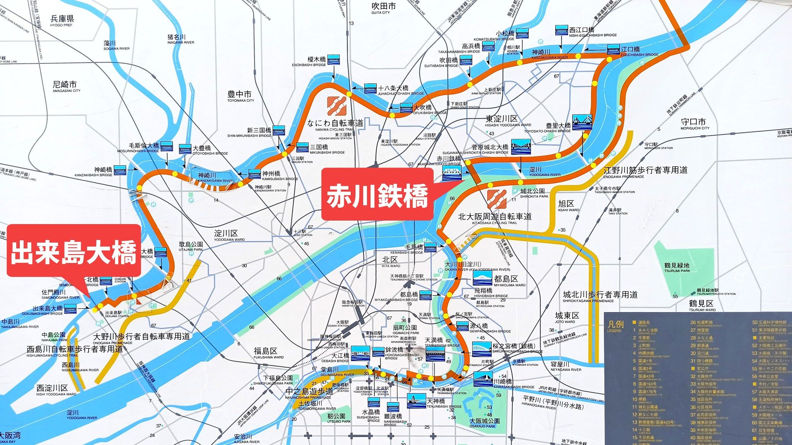

###  Table 1: Naniwa Cycling Road at a Glance

| Feature | Description |
| :---- | :---- |
| **Route Type** | Loop |
| **Approx. Distance** | 30km (18.6 miles) |
| **Terrain** | Predominantly flat, well-maintained paved riverside paths, with brief, manageable urban road sections. |
| **Difficulty** | Easy (Suitable for most fitness levels, including families, casual riders, and those new to cycling in Japan). |
| **Key Highlights** | Serene Kanzakigawa River, vibrant Yodogawa River activity, iconic Kema Lock, panoramic cityscapes (Umeda), unique Yagura Ryokuchi Park (where river meets sea), distinctive Ohnogawa Pedestrian & Bicycle Only Road. |
| **Best For** | Leisurely rides, urban exploration, nature appreciation, cultural immersion, photography, a relaxing escape from city bustle, a taste of local Osaka life. |
| **Recommended Time** | 2-3 hours (cycling time), allow 3-4 hours for leisurely stops and photos. |
| **Starting/Ending Point** | Enoki Bridge (flexible, easily accessible via public transport or from central Osaka). |

The inclusion of this summary table immediately after the introduction serves a crucial purpose for international travelers. When planning complex trips, visitors require quick, digestible, and accurate information to make informed decisions about activities. While a detailed narrative provides immersive storytelling, it may not immediately convey essential facts like distance, difficulty, or key features in a scannable format. This table addresses the need by providing all critical information at a glance, acting as a rapid decision-making tool. It enhances the user experience by offering immediate clarity, managing expectations, and aiding in itinerary planning, thereby making the article more practical and user-friendly and fulfilling the requirement for exhaustive detail in an accessible format.

##  II. The Journey Begins: From Enoki Bridge to the Yodogawa Embrace

###  Starting Point: Enoki Bridge – Your Gateway to Adventure

The adventure commenced on a pleasant, clear autumn afternoon, the ideal weather setting the stage for a comfortable ride. The starting point at Enoki Bridge proved to be remarkably convenient. Accessing the Naniwa Cycling Road from here was straightforward, as one simply descends from the bridge area to the path along the Kanzakigawa River.1

A particularly reassuring aspect for foreign riders is the exceptional clarity of the route's signage. The Naniwa Cycling Road signs are installed so frequently along the Kanzakigawa River that the entrance is easy to find. This abundance of clear signposts significantly reduces any anxiety about getting lost, providing a sense of confidence from the very outset. The ease of locating the entrance and the consistent guidance along the path are invaluable features for international visitors navigating an unfamiliar environment, directly contributing to a stress-free and enjoyable cycling experience.

###  Along the Kanzakigawa River: A Serene Overture

Once on the path, the journey began by turning around and proceeding upstream along the Kanzakigawa River.1 The path itself, while described as narrow, was quite easy to ride, offering a comfortable surface for a relaxed pace. This initial stretch provides a unique glimpse into local life; occasionally, there are fishermen quietly pursuing their pastime, adding a touch of authentic, untouristy charm to the experience. While the original observation noted the scenery as monotonous, with only the river and bridges, this can be reinterpreted as a period of meditative simplicity. This segment serves as a calm, rhythmic prelude to the more dynamic landscapes of the Yodogawa River, allowing riders to find their rhythm and soak in the quiet urban nature. It is a chance to appreciate the subtle beauty of urban infrastructure and the tranquil flow of the river, offering a different kind of scenic immersion.  

After a peaceful stretch, the path along the river eventually concluded, requiring a brief transition to a road section. This occurred after passing the confluence with the Ai River on the left.1 At this point, cyclists are directed up to the road.  
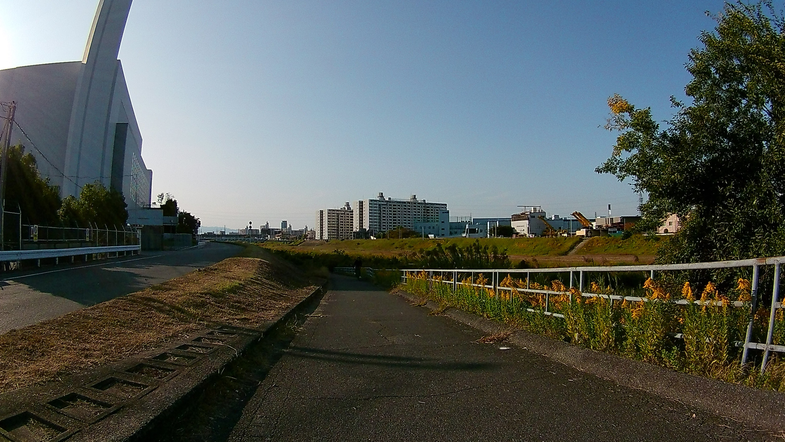  
A photograph taken looking back at where the riverbank path ended clearly illustrates this transition point.1 Navigating this brief urban segment proved to be straightforward. Proceeding straight on the road quickly led to a T-junction, where the path to ascend to the Yodogawa River embankment became apparent. Despite initial apprehension about finding the way on a first ride, there was no cause for concern about getting lost.1 This personal reassurance is highly valuable for foreign visitors, confirming that while transitions occur, the route remains intuitively navigable.
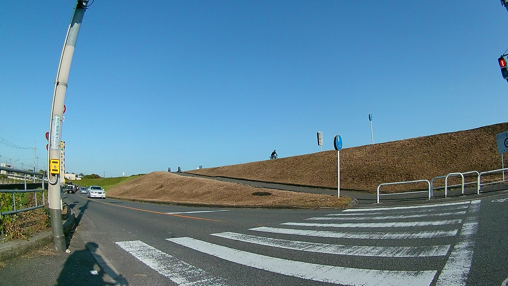

##  III. The Mighty Yodogawa: A Grand Riverside Descent

###  Ascending the Embankment: Panoramic Vistas Unfold

The ascent to the Yodogawa River embankment marks a dramatic shift in the cycling experience. Upon reaching the top, a wide view spreads out, immediately contrasting with the narrower confines of the Kanzakigawa. This elevated perspective offers a breathtaking sense of expanse and freedom, revealing the sheer scale and grandeur of the Yodogawa, one of Japan's major rivers. The panoramic vista stretches across the wide river, providing a refreshing sense of openness.  
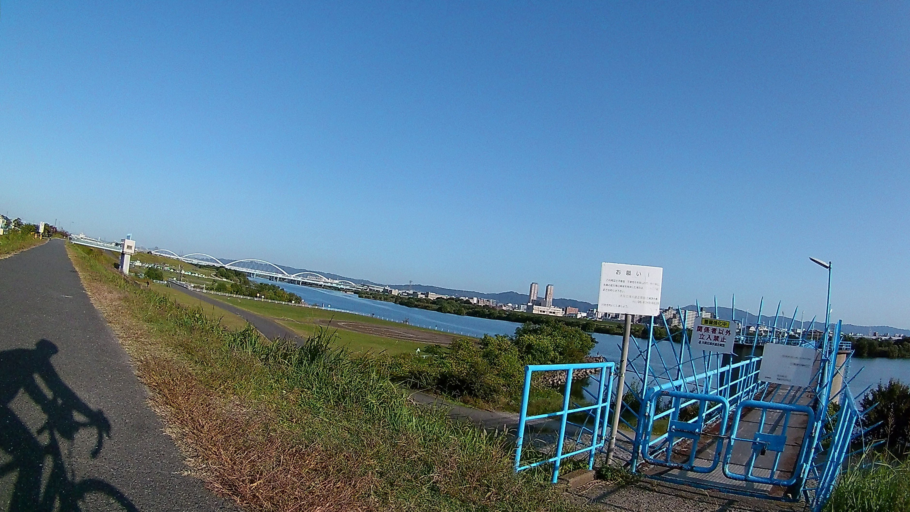

###  Life Along the Riverbank: Osaka's Green Heartbeat

The path along the Yodogawa embankment is equally inviting, described as an easy road to travel. While generally smooth, cyclists will encounter Yodogawa's unique bicycle stops periodically. These are distinctive features of Japanese cycling infrastructure, often U-shaped barriers or zigzag paths designed to slow cyclists down at certain points, typically for safety in busy recreational areas or to prevent unauthorized vehicle access. For foreign riders, understanding these features beforehand can prevent surprise; they require a brief slowdown or even a momentary dismount, but are minor interruptions that add to the local flavor of the ride.  
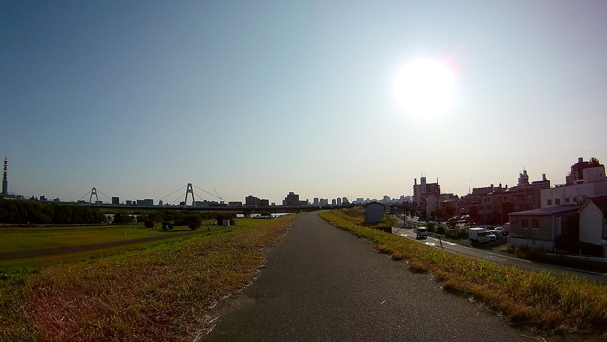
Beyond these practicalities, the Yodogawa riverbanks are a vibrant tapestry of local life. There are many places along the river where people are playing baseball and soccer. This offers a lively glimpse into Osaka's recreational culture, providing an authentic insight into how local communities utilize their green spaces for leisure and sport. Observing these activities adds a rich layer of cultural immersion to the cycling journey. The bustling atmosphere along the river reflects its role as a vital green artery for the city.

###  Navigating Urban Intersections: Toyosato Ohashi Bridge and Beyond

As the journey continues, the route approaches the prominent Toyosato Ohashi Bridge. At this point, the direct riverside path appears to be impassable for straight-through passage. Therefore, cyclists are directed to go down the bank to the road below. This transition requires careful attention to urban traffic, but it is a manageable segment that integrates the route into the city's broader infrastructure. Such brief encounters with urban roads are part of the Naniwa Cycling Road's charm, showcasing its blend of natural serenity and city integration.  
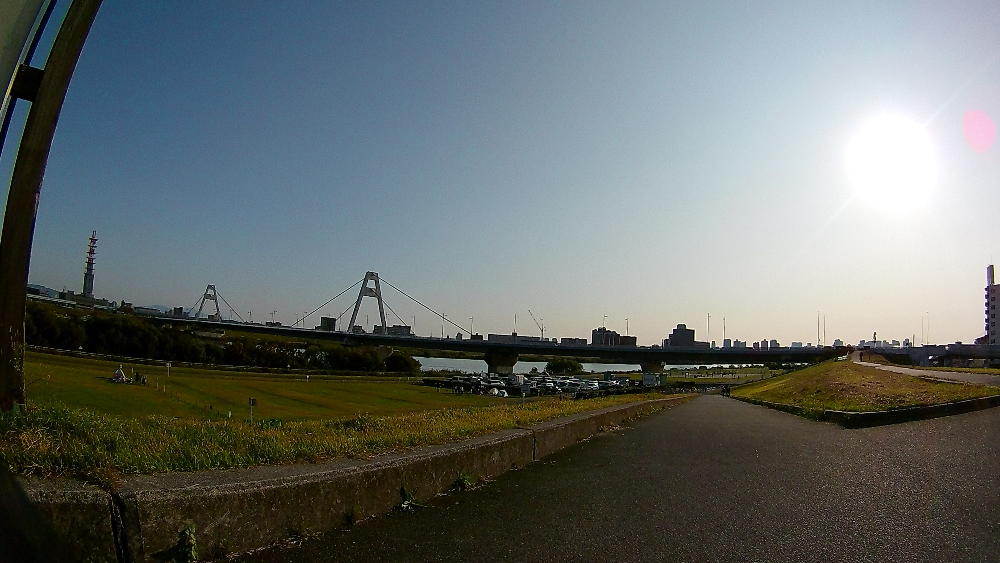

###  Yodogawa Riverside Park: A Community Oasis

The area beneath the Toyosato Ohashi Bridge transitions into the expansive Yodogawa Riverside Park, a significant community hub. This park is a lively space, featuring a parking lot and attracting a lot of people. A particularly vibrant sight is the barbecue area, and it was crowded with many people. This bustling scene offers a fascinating window into local Japanese leisure and community spirit. It serves as a perfect spot for a brief break, people-watching, or even grabbing a snack from a nearby convenience store, allowing visitors to soak in the authentic atmosphere of Osaka's green heart. The park's popularity underscores its role as a cherished recreational space for residents.  
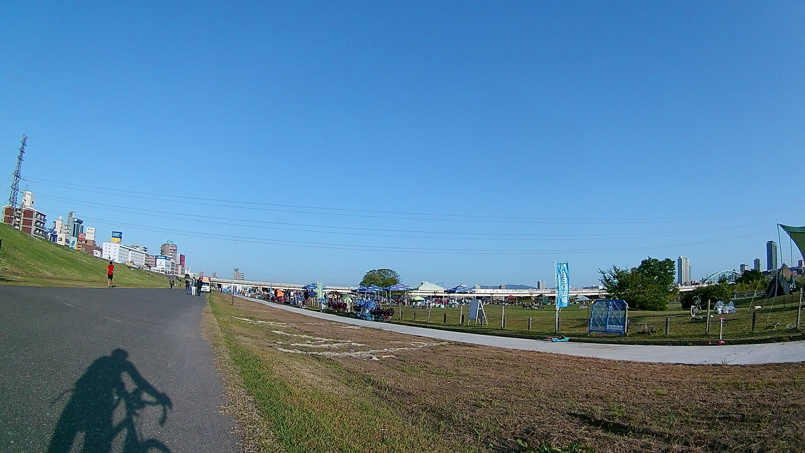

###  The Iconic Kema Lock: A Glimpse into Osaka's Waterways

Further along the Yodogawa, the impressive Kema Lock becomes visible on the opposite bank.1 This is more than just a landmark; it is a critical piece of Osaka's infrastructure, playing a vital role in water management and flood control for the city. Its strong presence is evident even from a distance, highlighting its engineering significance. The author's previous experience of passing through the left bank when riding other routes, such as the Kita-Osaka Cycle Line and the Kitakawachi Cycle Line 1, further underscores the lock's prominence and its integral role within Osaka's interconnected network of waterways and cycling paths. This provides a valuable glimpse into the city's historical relationship with its rivers and its ongoing efforts in urban planning and water management.

###  Towards the City's Embrace: Yodogawa Ohashi and Umeda's Skyline

Continuing along the Yodogawa, the path eventually leads to the vicinity of the Yodogawa Ohashi Bridge. At this point, the dedicated riverside path concludes, necessitating another transition onto a public road.1 This segment offers a dramatic visual contrast to the natural river scenes encountered earlier.  
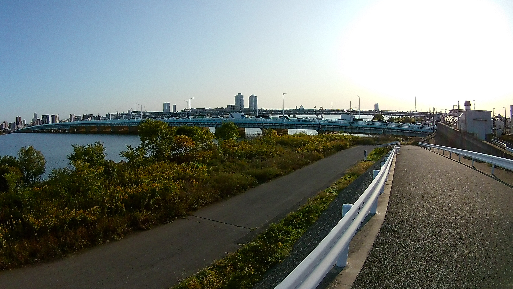
From this vantage point on the road, looking upstream, the skyscrapers around Umeda are lined up. This impressive urban vista showcases Osaka's dynamic cityscape and its modern architectural prowess, providing a striking reminder of the city's vibrant core amidst the tranquility of the riverside journey. It's a powerful visual representation of Osaka's blend of natural beauty and urban development.  
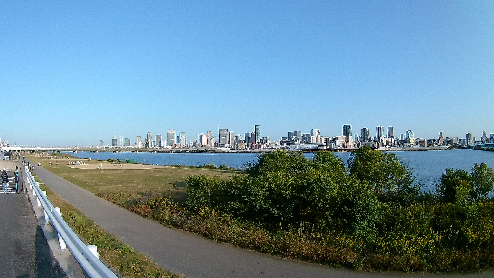

##  IV. Towards the Sea: A Shifting Landscape and Sunset Serenity

###  Under Denpo Ohashi Bridge: A Gateway to the Estuary

The journey continues along the road parallel to the river, leading to a distinctive architectural feature: the Denpo Ohashi Bridge. After crossing the Hanshin Namba Line railroad crossing, the bridge appears remarkably low overhead.
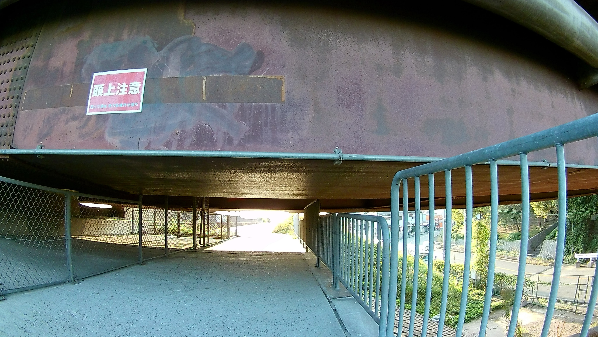
Navigating directly beneath it presents a unique, albeit slightly challenging, experience: It's finally high enough for a bicycle to pass. I pushed my bicycle through while squatting. This quirky passage adds a memorable, slightly adventurous element to the ride.  

However, a valuable lesson learned from this experience is that an easier alternative exists. By observing the surroundings, one can see a public road to the right. If I had looked to the right, there was a road, so I might have been able to pass normally by deviating to the right a little at the T-junction. This practical advice is crucial for future riders, allowing them to choose a smoother passage and avoid the need for dismounting and crouching.

###  The Changing Vibe: From Bustle to Tranquility (and a hint of desolation)

A noticeable shift in atmosphere occurs immediately after passing under the Denpo Ohashi Bridge. While the right bank of the Yodogawa River up to this point was characterized by a lively ambiance, bustling with people playing baseball and soccer, the environment beyond the bridge transforms.1 The area becomes less populated, and observations include fewer people, abandoned 'mamachari' bicycles, and people staring blankly at the river. This transition reveals a more raw, unfiltered side of Osaka, where the urban landscape meets the estuary in a starker, less manicured fashion.  
The original author expressed a feeling of unease in this section, noting an atmosphere that I didn't want to pass through after sunset and the complete absence of other road bike riders.1 This observation is important for safety and comfort. While the daytime offers a unique, contemplative glimpse into this less-polished facet of the city, it is strongly recommended that cyclists plan their ride to complete this segment well before dusk. This ensures a more pleasant and secure experience, allowing appreciation for the unique, almost melancholic beauty and stark contrasts visible during daylight hours. The presence of "mamachari" (local utility bikes) can be seen as a sign of everyday local life, adding to the authenticity of this urban edge.

###  Chasing the Sunset to Yagura Ryokuchi Park

With the sun beginning its descent, the journey continued straight ahead, facing the setting sun. This segment of the ride offers a dramatic visual experience, with the changing light casting long shadows and reflecting off the water. The anticipation builds towards the destination at the very mouth of the Yodogawa River, where it meets the sea.  
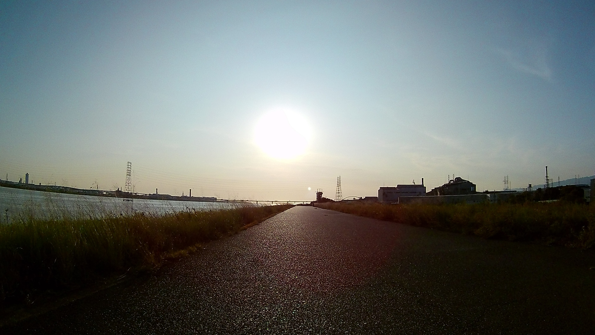

###  Yagura Ryokuchi Park: Where River Meets Sea

The culmination of this leg of the journey is Yagura Ryokuchi Park, a distinctive geographical point. Located at the tip of the right bank of the Yodogawa River, and beyond is the open sea, it marks the unique confluence of fresh river water and the vast expanse of the bay. The scene at the park often includes several fishermen, quietly engaged in their pastime, adding a tranquil, local touch to the environment.  

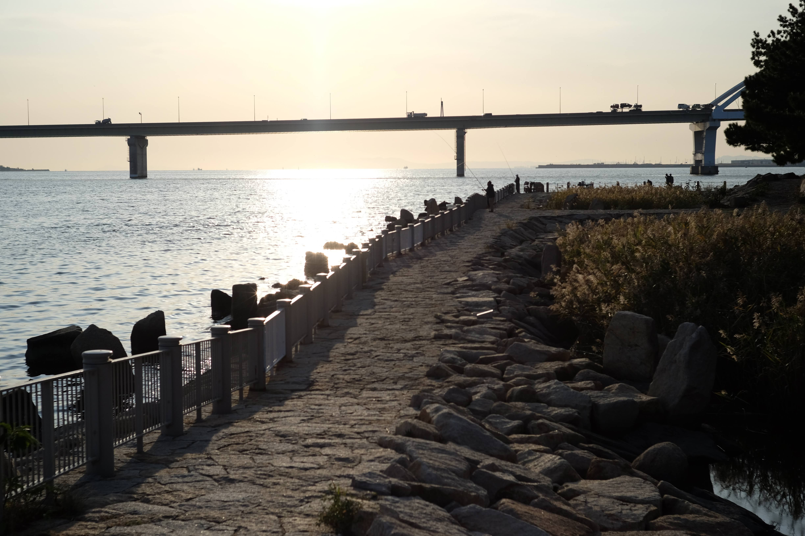
While described as a place with a nice view, the author's personal experience involved a quick departure, driven by a desire to get back before sunset. For international visitors, it is important to manage expectations regarding the "sea view." This is not a pristine, sandy beach vista, but rather an urban estuary where the mighty Yodogawa meets the industrial bay. The beauty lies in this unique urban-natural interface, the vastness of the water, and the quiet presence of local life. Visitors are encouraged to take their time, especially if visiting earlier in the day, to fully appreciate this unique geographical point and the subtle beauty of the river's end. This perspective transforms a potentially rushed experience into an opportunity for contemplation and appreciation of Osaka's distinctive coastal edge.

##  V. The Return Journey: Discovering Hidden Paths

###  Returning on the Yodogawa Right Bank

Following the visit to Yagura Ryokuchi Park, the return journey commenced along the familiar Yodogawa right bank.1 This segment offers a chance to re-experience the vibrant riverside atmosphere, perhaps noticing new details or appreciating the scenery under a different light as the day progresses. The familiarity of the path provides a comfortable rhythm as the loop continues.  
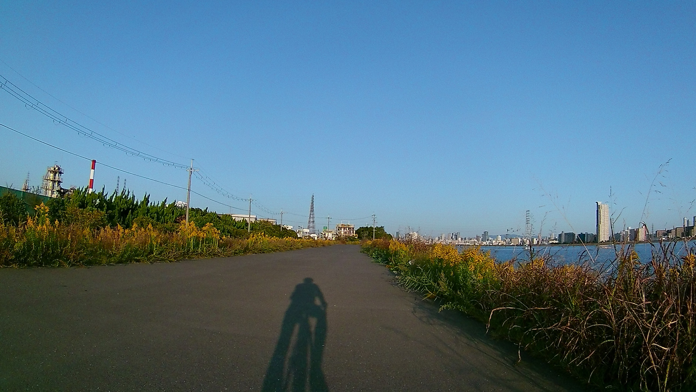

###  Nishijima Floodgate and the Ohnogawa Pedestrian and Bicycle Only Road: A Verdant Detour

A key point on the return leg is the Nishijima Floodgate. After reaching this landmark, the route turns left, leading to the entrance of the Ohnogawa Pedestrian and Bicycle Only Road.1  
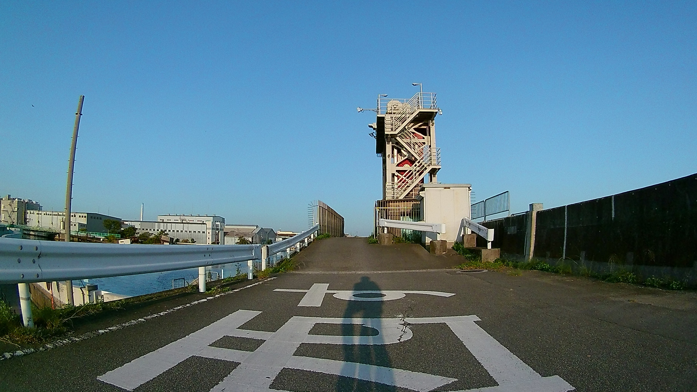

This unique path is described as being like a promenade between the roads, offering a distinct cycling experience. Its most striking feature is its blue-painted bicycle-only road, which guides cyclists through the forest. This unexpected green tunnel provides a refreshing contrast to the more open riverside paths, creating a sense of seclusion and natural immersion within the urban sprawl.  

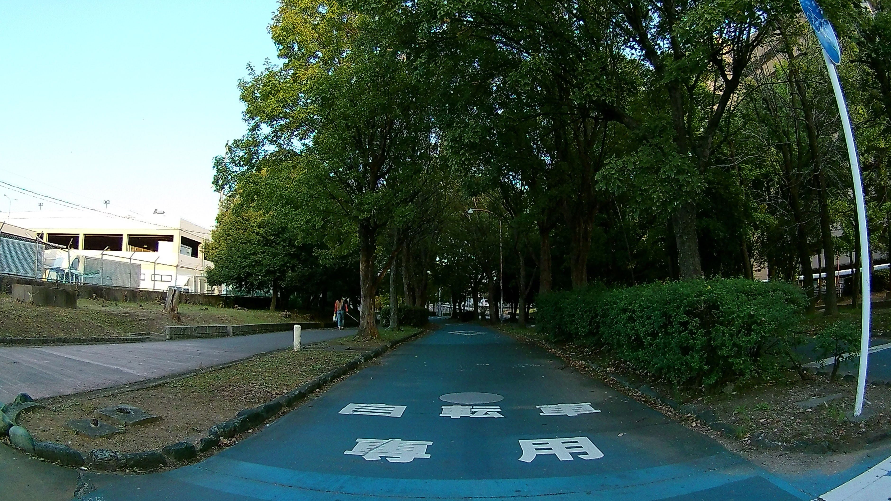

However, it is important to note a practical consideration for this section: the presence of midges. The author candidly observed that the path was full of midges and got in my eyes and mouth, which was unpleasant, but the road itself was easy to ride. While this can be a minor nuisance, particularly during certain seasons, it is easily mitigated by wearing cycling glasses or a light buff. Despite the midges, the path remains highly enjoyable and easy to navigate. Though initially noted as having no particular sights to see, the true value of this segment lies in the unique experience of cycling through a verdant, secluded corridor, making it a distinctive urban oasis for pure cycling enjoyment.

##  VI. The Final Stretch: Kanzakigawa Left Bank to Enoki Bridge

###  Rejoining the Naniwa Cycling Road: A Different Perspective

From the Ohnogawa Pedestrian and Bicycle Only Road, the route turns left once more, passing under a highway, before rejoining the Naniwa Cycling Road along the left bank of the Kanzakigawa River from Chibune Ohashi Bridge.1

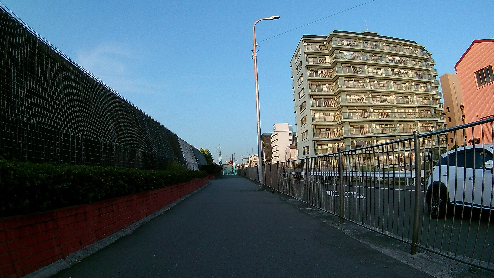

This segment offers a different perspective of the Kanzakigawa compared to the initial right bank ride, providing a fresh look at familiar surroundings. 

###  Riverside, Yet Hidden: A Unique Charm

A peculiar characteristic of this final stretch along the Kanzakigawa is that the path continues for a while where the river is completely invisible. While this might seem counterintuitive for a riverside path, it creates a unique sense of urban immersion. The river, though unseen, remains a constant presence, guiding the route through quieter residential or industrial areas, offering an unvarnished view of local Osaka life away from the immediate riverfront. Eventually, the path emerges back to the visible riverside from around the JR line bridge, signaling the final approach to the starting point. This segment, though lacking direct river views, contributes to the route's diverse character, showcasing its adaptability within the urban fabric.  

###  The Homestretch: A Satisfying Conclusion

From the JR line bridge, the path continues steadily along the river, leading directly to the designated goal.1 The journey culminates with the return to Enoki Bridge 1, completing the full loop of the Naniwa Cycling Road. While the author's overall sentiment noted "not many landmarks or sights to see" and a somewhat rushed experience at the sea view, and observed that the exercise intensity was low, the overarching impression was undeniably positive: it was a pleasant cycling trip on a clear autumn day. This encapsulates the true value of the Naniwa Cycling Road for a relaxed, authentic, and enjoyable experience. It reinforces that not every ride needs to be a strenuous challenge or a landmark-packed tour. Instead, its charm lies in the simple joy of cycling, the gentle pace, and the unique blend of urban and natural landscapes it offers. The route is ideal for those seeking a tranquil escape and a genuine connection with Osaka's everyday rhythm.  
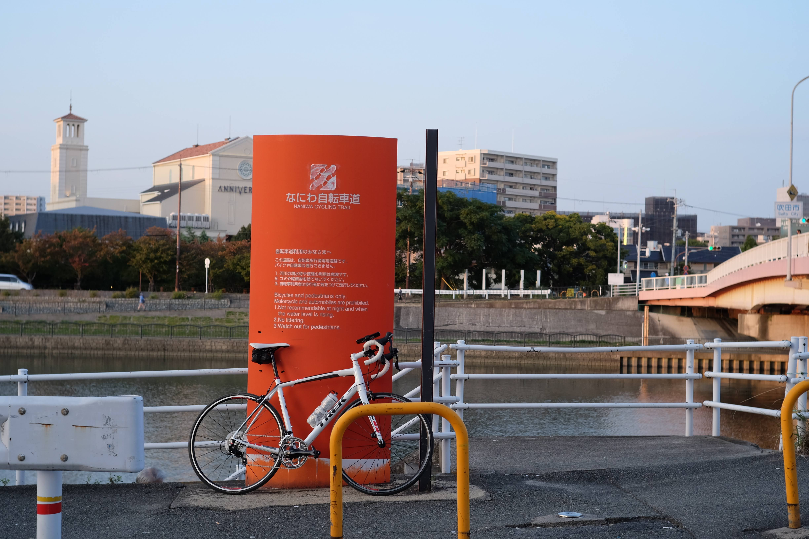

##  VII. Overall Impressions and Recommendations for Your Naniwa Adventure

###  A Relaxed Ride for All: Embracing the Naniwa Pace

The Naniwa Cycling Road stands out as an excellent choice for cyclists of all levels, particularly those seeking a relaxed and immersive experience. As noted, it is a good course for riding at your own pace for about 30km. This emphasis on personal pace underscores its suitability for casual riders, families, or anyone looking for a gentle exploration rather than a high-intensity workout. While the exercise intensity was observed to be low, this is precisely its strength for a broad audience. It is perfect for a leisurely ride, an enjoyable outing with family, or even for testing new cycling gear without the demands of a strenuous challenge. The primary reward of this route lies in the inherent pleasure of cycling on a pleasant cycling trip on a clear autumn day, offering a refreshing escape into Osaka's unique urban-nature blend.  
For those with limited time or a preference for a slightly shorter route, a practical alternative exists. Instead of continuing all the way to the sea at Yagura Ryokuchi Park, one can opt to turn back towards the Kanzakigawa River around the Nishijima Floodgate area.1 This offers valuable flexibility, allowing riders to tailor the journey to their specific preferences and time constraints, ensuring a fulfilling experience even if the full loop is not completed.

###  Optimizing Your Experience: Practical Tips for Foreign Riders

To ensure a seamless and enjoyable Naniwa Cycling Road adventure, consider the following practical recommendations:

* **Best Time to Ride**: The author's experience on a clear autumn day highlights this season as ideal, with pleasant temperatures and clear skies. Spring is also highly recommended for comfortable weather and the potential for blooming flora. It is advisable to avoid the peak summer months due to high humidity and heat. Furthermore, based on observations of the changing atmosphere, it is strongly recommended to complete the section near Denpo Ohashi Bridge and the approach to Yagura Ryokuchi Park during daylight hours for optimal comfort and safety.  
* **Gear Recommendations**:  
  * **Bike Type**: The route is well-suited for a variety of bicycles. While a road bike was used for the original ride, hybrid bikes or even comfortable city bikes are perfectly adequate, given the predominantly flat and well-maintained paths.  
  * **Essentials**: Always carry sufficient water, especially on warmer days, along with some snacks. A basic repair kit (spare tube, pump, tire levers) is advisable, though unlikely to be needed on such a well-maintained path. A fully charged smartphone with offline maps and a portable charger are highly recommended for navigation and emergencies.  
  * **Safety Gear**: A helmet is always recommended for safety. Sunglasses are particularly useful, not just for sun protection, but also to mitigate the minor nuisance of midges that can be encountered on sections like the Ohnogawa Pedestrian and Bicycle Only Road.1 If there is any chance of riding near dusk, front and rear lights are essential.  
* **Navigation Tips**: While the "Naniwa Cycling Road" signs are frequent and make the entrance easy to find, having a GPS-enabled smartphone with a cycling app or a dedicated cycle computer (like the XOSS G mentioned 1) can provide extra confidence, especially during the brief urban transitions. Downloading offline maps beforehand is a smart precaution.  
* **Safety & Etiquette**: Familiarize yourself with basic Japanese cycling rules: always ride on the left side of the road/path. Yield to pedestrians, especially in crowded areas like Yodogawa Riverside Park. Use your bell politely to alert others. Be aware of the unique bicycle stops and slow down or dismount as necessary. Always park your bicycle in designated areas.

###  Beyond the Ride: Nearby Attractions & Culinary Delights

The Naniwa Cycling Road offers more than just a ride; it's a gateway to experiencing authentic Osaka. After completing the loop, consider exploring nearby neighborhoods for local eateries, where you can savor authentic Osaka cuisine like takoyaki or okonomiyaki. The vibrant Umeda district, with its towering skyscrapers visible from the Yodogawa, is easily accessible and offers extensive shopping and dining options. The Yodogawa Riverside Park, with its lively barbecue area, is also a perfect spot for a relaxing break, a picnic, or simply people-watching. These extensions allow for a deeper immersion into the city's culture and lifestyle.

###  The Author's Take: Naniwa in Context

While the Naniwa Cycling Road offers a delightful experience, it is worth noting that individual preferences for cycling routes can vary. The author, for instance, personally expressed a preference for the Kitakawachi Cycle Line. This preference does not diminish the Naniwa route's appeal but rather highlights the diverse cycling opportunities available in Osaka. The Naniwa Cycling Road excels as a leisurely urban exploration, offering local immersion and a unique blend of urban and natural landscapes. In contrast, the Kitakawachi Cycle Line might appeal more to those seeking longer distances, more varied scenery, or a different level of challenge. Understanding these distinctions allows cyclists to choose the route that best aligns with their specific interests and desired cycling experience, demonstrating the breadth of Osaka's offerings for every type of rider.

##  VIII. Explore More of Osaka's Cycling Network

###  Introduction to Osaka's Broader Cycling Vision

Osaka is actively investing in its cycling infrastructure, a commitment underscored by significant development projects. Osaka Prefecture, Osaka City, and Sakai City are promoting a bicycle path maintenance project with the aim of the 2025 Osaka Expo. This initiative reflects a broader vision to enhance urban mobility and recreational opportunities for both residents and visitors. With the Expo having been held, a substantial portion of these planned routes has been opened, signifying a growing and improving cycling network across the region.1 This forward-looking approach positions Osaka as an increasingly attractive destination for cycling tourism, promising even more diverse and well-maintained routes in the future.

###  Table 2: Osaka's Premier Cycling Routes: A Comparative Overview

| Route Name | Type | Approx. Distance | Key Features | Ideal For |
| :---- | :---- | :---- | :---- | :---- |
| **Naniwa Cycle Road** | Loop | 30km (18.6 miles) | Urban rivers, sea view (estuary), local life, accessible | Leisure, urban exploration, local immersion, easy ride |
| **Kitakawachi Cycle Line** | Loop | 45.5km (28.3 miles) | Large-scale, diverse landscapes, river views, Tsurumi Ryokuchi Park, Hotanigawa River | Longer rides, varied scenery, fitness, exploration |
| **Minamikawachi Cycle Line** | Linear/Loop | Variable | Historical sites (Jinai-cho, Kofun Group), nature, cultural immersion, Ishikawa Cycle Bridge | Culture, nature, historical exploration, longer rides, sightseeing |
| **Inagawa Cycling Road** | Linear | Variable | Scenic river, seasonal beauty (plum blossoms at Hattori Ryokuchi Park), Satsuki-dai Park | Relaxed, nature, seasonal beauty, family rides, cherry blossom viewing (if applicable) |

This comparative overview serves as a valuable planning tool for international travelers, enabling them to quickly assess and choose the most suitable cycling experience within Osaka's diverse network. By presenting key features, distances, and ideal uses for each route, it empowers readers to make informed decisions that align with their fitness levels, time availability, and specific interests, whether they seek historical immersion, natural beauty, or a challenging ride. This structured comparison enhances the overall utility of the report, providing comprehensive guidance for exploring Osaka on two wheels.

###  Detailed Overviews of Related Routes

Beyond the Naniwa Cycling Road, Osaka offers several other compelling routes, each with its unique character and attractions.

####  Kitakawachi Cycle Line: A Grand Loop Through Diverse Landscapes

For cyclists seeking a more extensive journey, the Kitakawachi Cycle Line presents an appealing option. This is one of Osaka Prefecture's large-scale bicycle paths, offering a significant 45.5km (28.3 miles) loop. The route provides a diverse cycling experience, starting at Tsurumi Ryokuchi Park and winding through various landscapes. It proceeds along the Osaka Chuo Kanjosen Line, then follows the Yodogawa Left Bank, continues along the Hotanigawa River, and eventually loops back via the Daini Keihan Expressway.1 This route is ideal for those looking for a longer ride with more varied scenery, combining urban stretches with natural riverside views, and offering a good opportunity for fitness and exploration.

####  Osaka's Vision for Cycling: The 2025 Expo Legacy

Osaka's commitment to enhancing its cycling infrastructure is a significant development for bike tourism. The ongoing bicycle path maintenance project with the aim of the 2025 Osaka Expo represents a strategic investment in creating a more bike-friendly city. With the Expo having taken place, a large part of it has been opened, indicating substantial progress. This continuous development ensures that Osaka's cycling network will continue to improve, offering increasingly connected, well-maintained, and diverse routes for future visitors. This forward-looking initiative positions Osaka as a burgeoning hub for urban and recreational cycling in Japan.

####  Minamikawachi Cycle Line: History, Nature, and Cultural Immersion

The Minamikawachi Cycle Line offers a captivating blend of cycling and cultural exploration. While the starting and ending points may not feature prominent symbolic landmarks, the route itself provides a highly rewarding experience. The river along the path was pleasant to ride, and the road was well-maintained and easy to ride, ensuring a comfortable journey. A key highlight of this route is its integration with historical sites. On the return path, cyclists can make detours to fascinating sightseeing spots such as Tondabayashi Jinai-cho, an area where old townscapes remain, offering a glimpse into traditional Japanese architecture and history. Furthermore, the route passes through the Furuichi Kofun Group, including the impressive Konda Gobyoyama Kofun 1, allowing for exploration of ancient burial mounds. The presence of other sights to see, such as the Ishikawa Cycle Bridge, ensures that riders remain engaged and won't get bored, making it an excellent choice for those interested in combining cycling with historical and cultural immersion.

####  Hattori Ryokuchi Park & Inagawa Cycling Road: Seasonal Beauty and Serene Escapes

For a more relaxed, nature-focused ride, the Hattori Ryokuchi Park and Inagawa Cycling Road offer a delightful experience. The author's account describes a pleasant cycling trip along the Inagawa River, undertaken after a sudden warm spell.1 The ride began after visiting Hattori Ryokuchi Park to admire its plum blossoms, then proceeded upstream along the Inagawa River to Satsuki-dai Park.1 This route is particularly appealing for its seasonal beauty, offering opportunities to enjoy natural landscapes and perhaps even cherry blossoms depending on the time of year. It is an ideal choice for families or anyone seeking a serene escape into nature, combining gentle cycling with scenic parks and riverside tranquility.
