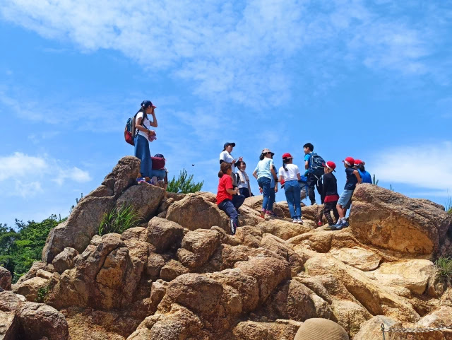

June is a rany season in most parts of Japan. It was a happy sunny holiday when I decided to climb "Rock Garden" in Mt. Rokko with my family. Contrary to its name, Rock Garden, climbing the route is easy and fun. Recommended for kids and families.

## Climbing Route



Access to Ashiyagawa Sta.: 20 min. from Osaka-Umeda by train (Hankyu Kobe line).
Parking lot: There are several small parking lots around Ashiyagawa Sta.
Climbing route: Total distance 6.0km. Time 3:39.

## Ashiyagawa Sta.

There are several small parking lots around Ashiyagawa Sta. but some of those was full. It was a little hard to find one in the late morning.

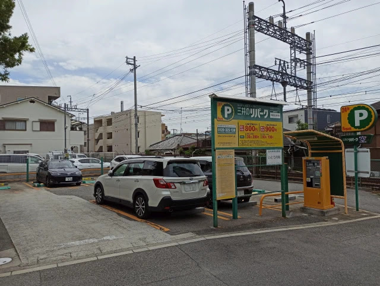

Rock Garden is North of the station. We went through under the overpass.

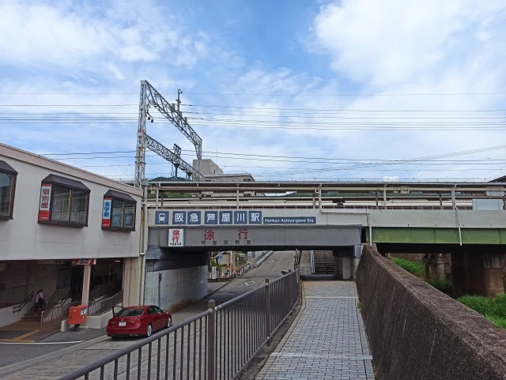

30 min. walk from the station to the entrance of Rock Garden through residential area. The signboard helps to find the route.

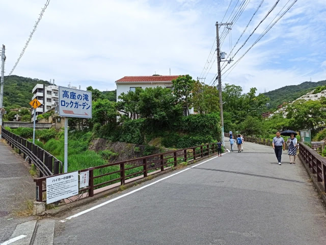

There are large houses rich people may be living in.

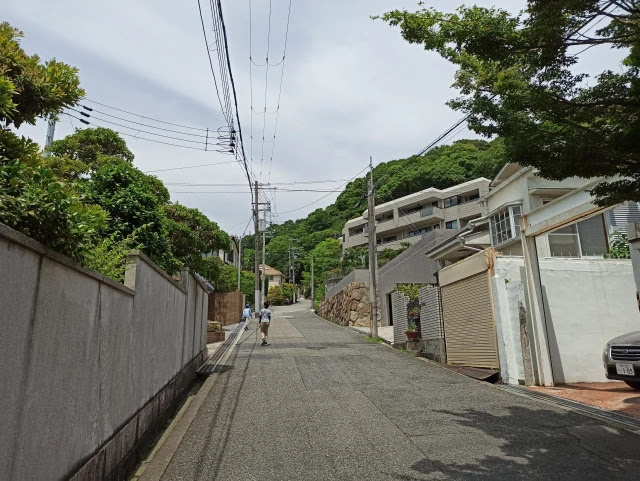

## Rock Garden

Walked for a while after passing the residential area, we arrived the entrance of Rock Garden. It looks like an entrance of an amusemen park but no one was there. We had a short rest then just passed it.

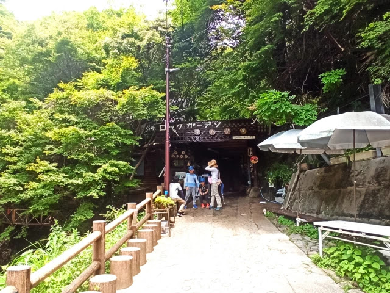

It says "cafe" but it looks closed and left for a long time.

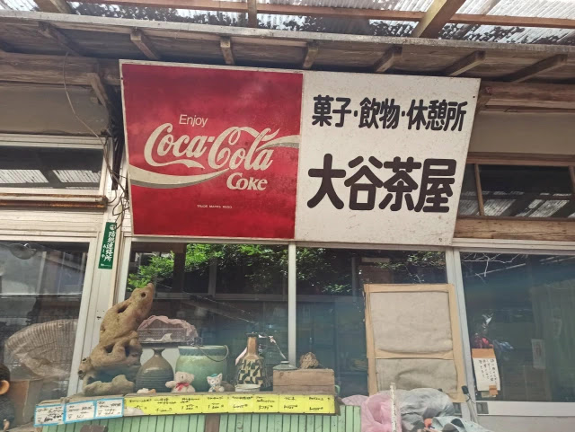

There is a small waterfall just after the entrance. Chlidren were playing there.

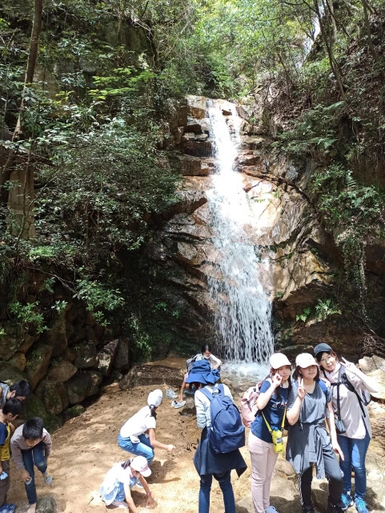

Rock climbing starts here. You don't need any special rock climbing equipment.

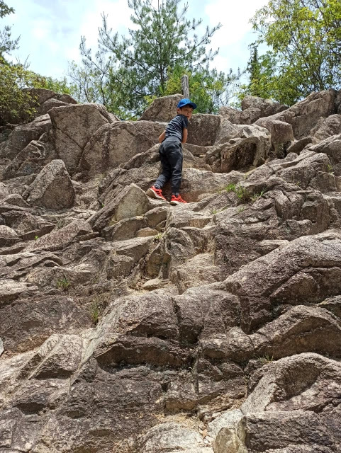

My dauter, 3 years old, tried even harder!

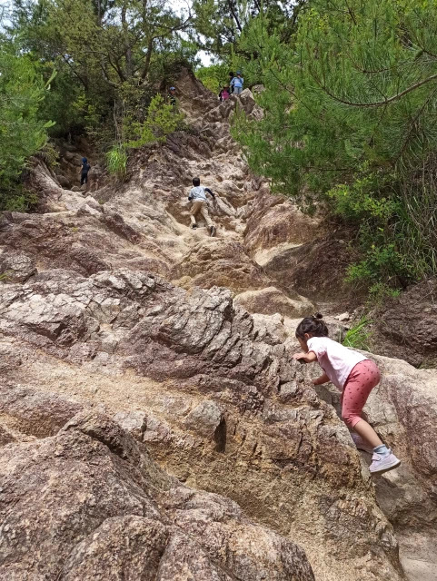

A lot of people were climbing in a line.

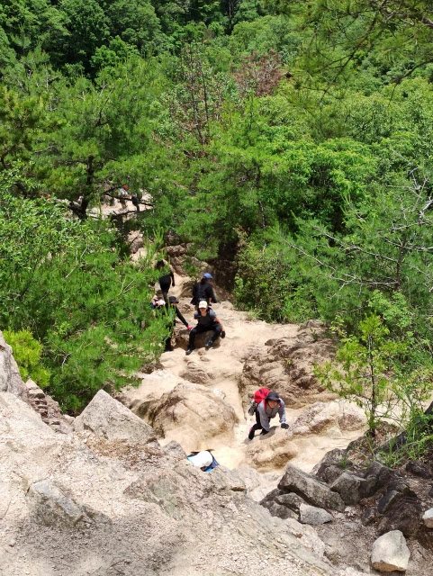

Taking a rest at the flat place.

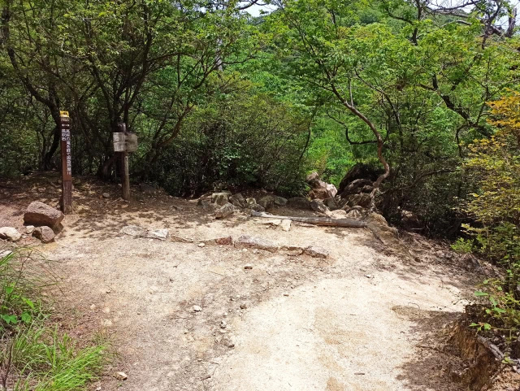

Rocky place still continued!

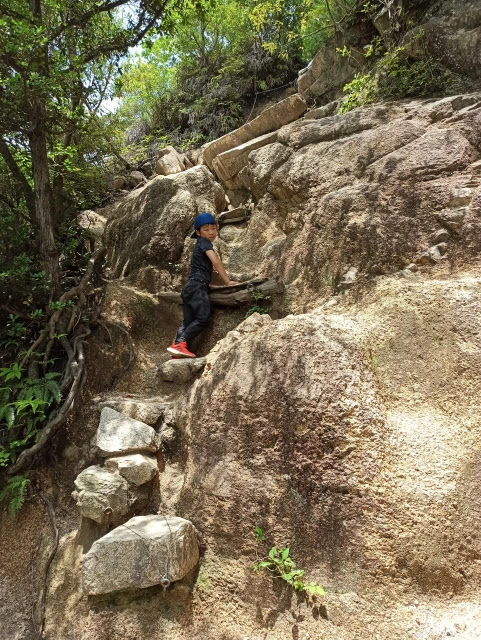

We reached the place where the rust steel tower stands on.

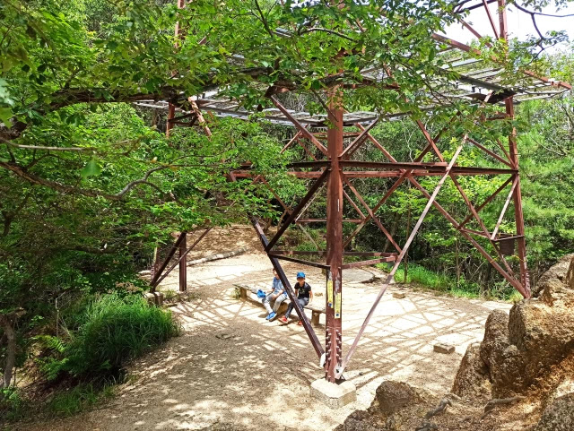

The trail became gradual. Rock climbing had finished.

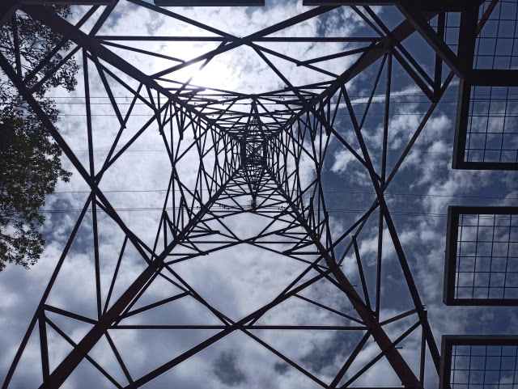

Walking on an interesting weathered granite.

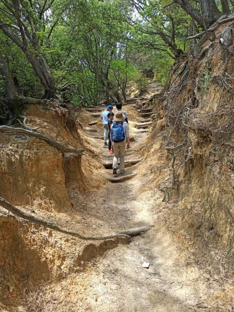

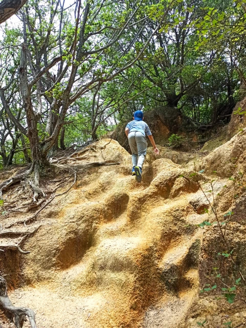

Lunch time!

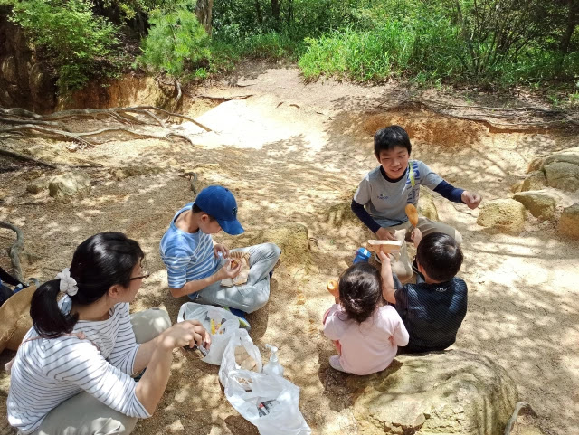

After passing next steel tower,

we got a superb view.

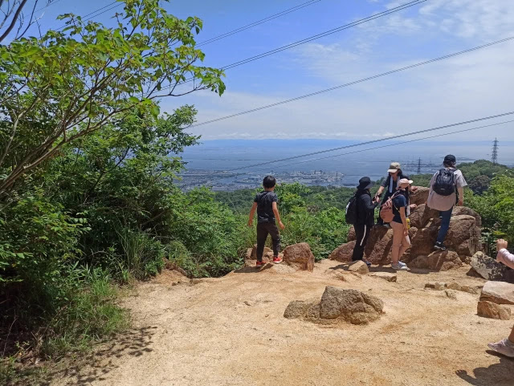

## Kazafuki Rock

Finally arrived at Kazafuki Rock, today's summit.

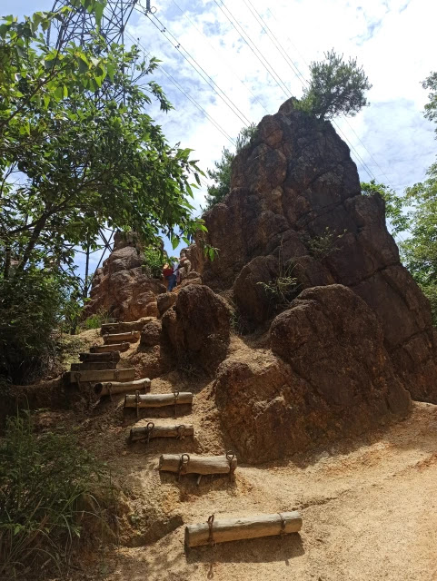
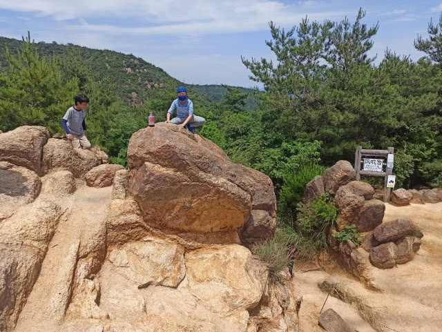

The place was clouded with people. The view from here is not so good. It is still in the middle of Rokko mountain but we were satisfied after the funny climbing.

My kids slided down from the rock.

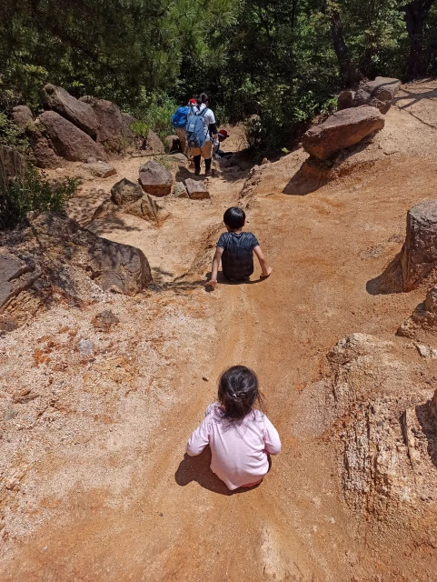

## Flog Rock

We went down in a forest.

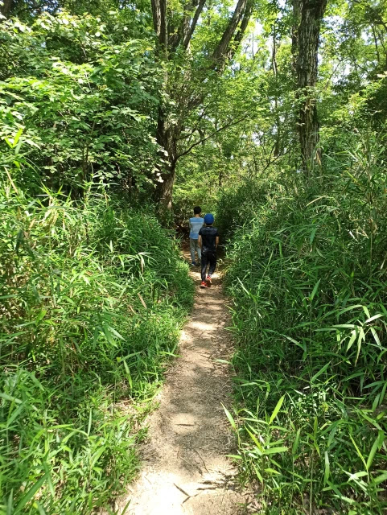

There is a rock called Flog Rock. Does its shape look like a flog??

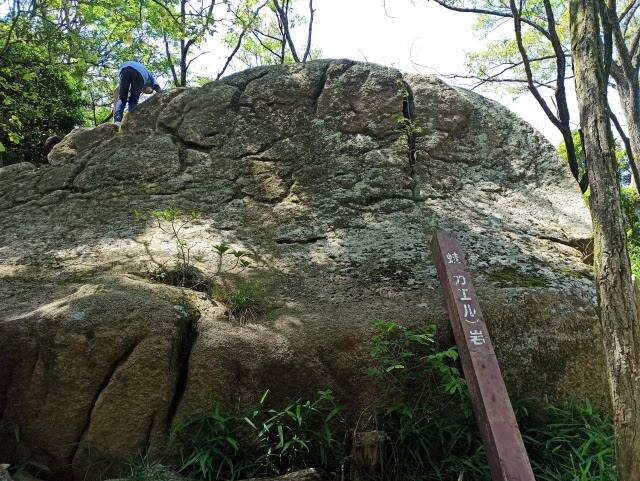

## Egenoyama Ruins

People were resting in a open space. This is Egenoyama Ruins. 

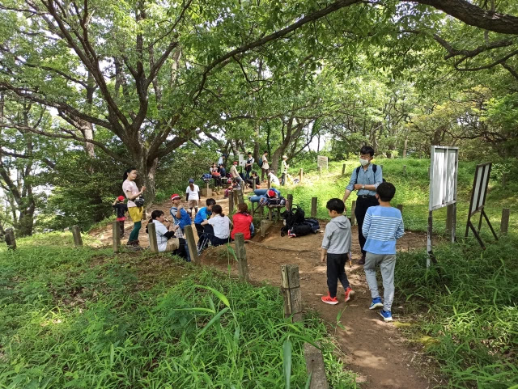

Vestiges of ancient residences, graves, ritual places and so on from 2000 years ago were found.

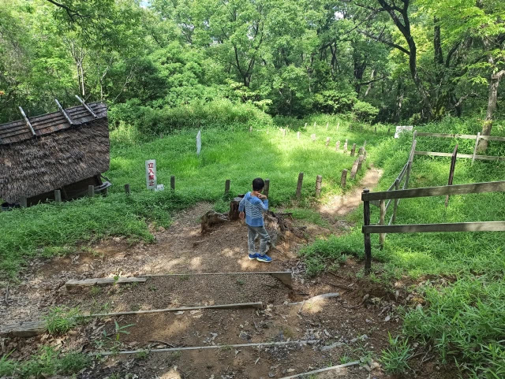
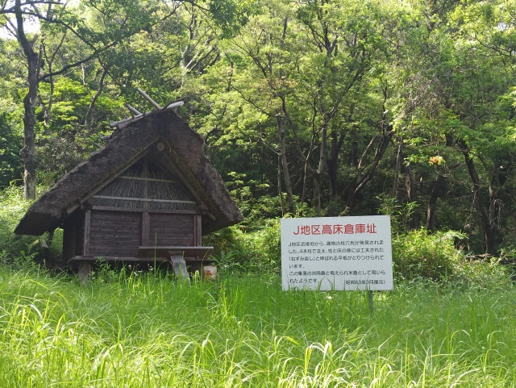

After passing the ruins, we arrived the gate at which mountain trail ends.

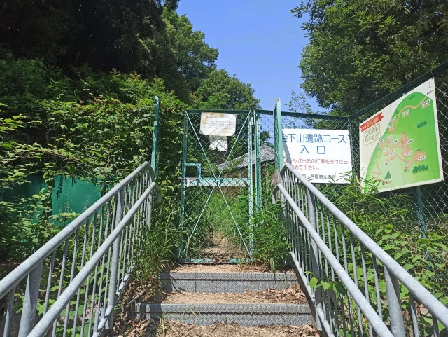

Everybody was so tired that they sit or lie on the road!

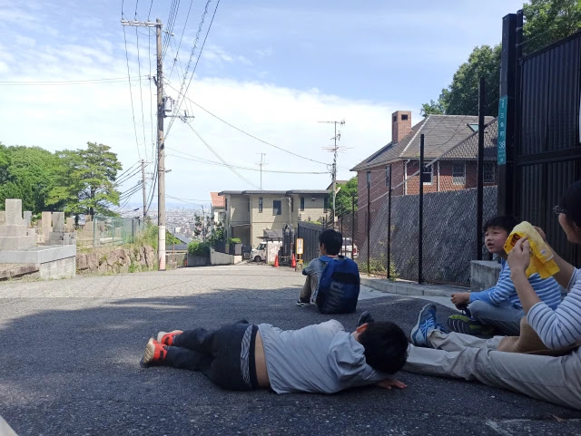

Walked down in the residential area looking for a vending machine but we hadn't found one.

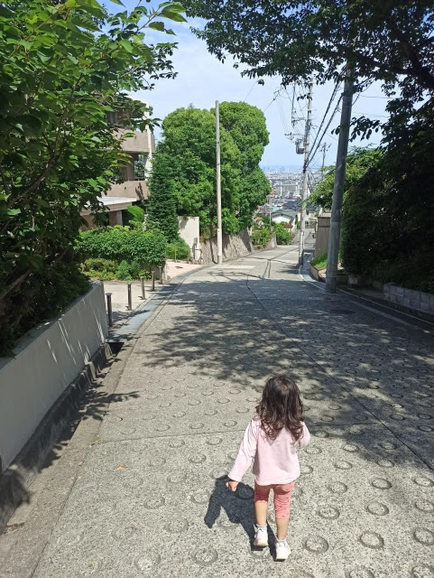

This travel ends at Ashiyagawa Sta. Finally we got drinks at a convenience store.

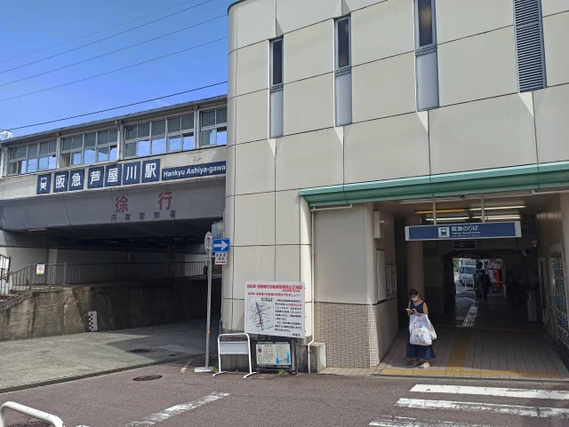

## Summary

Rock garden is a good place to have an experience of rock climbing for beginners. It is not far from the station and the residential place. Just three and a half hours takes you a short and interesting place.
