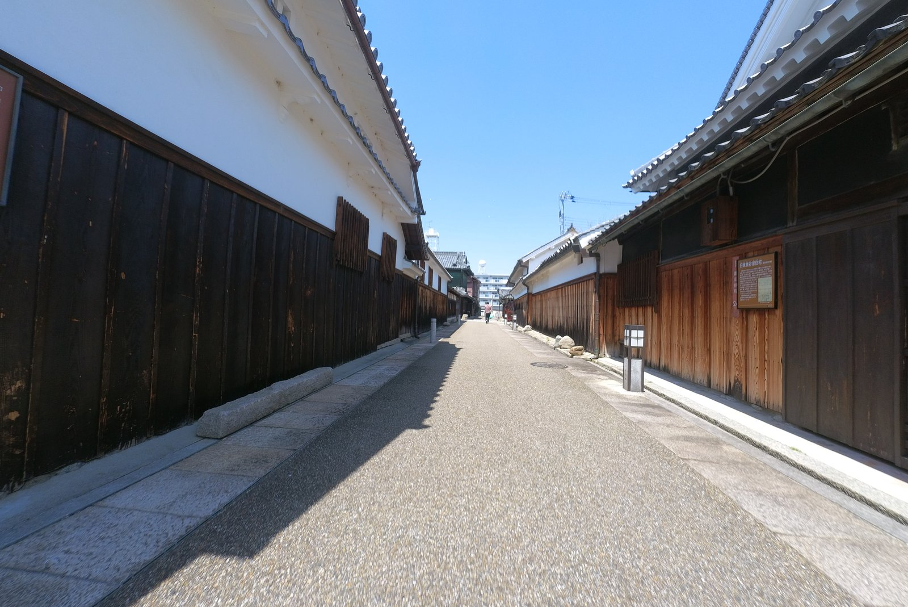
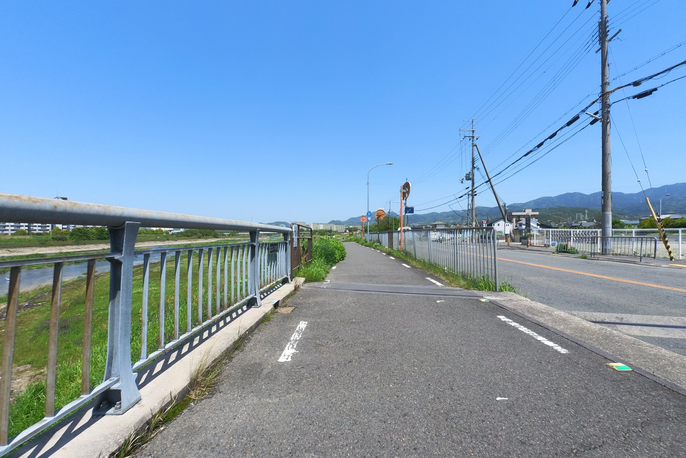
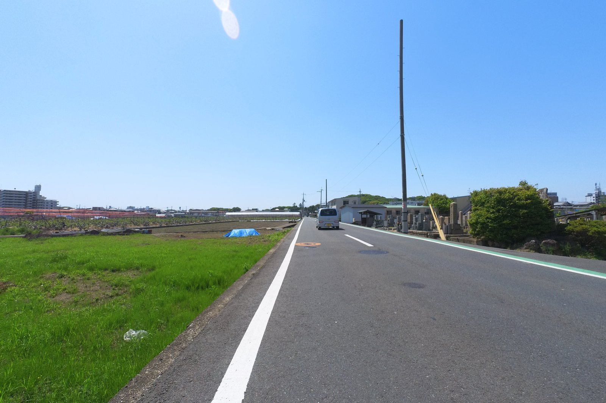
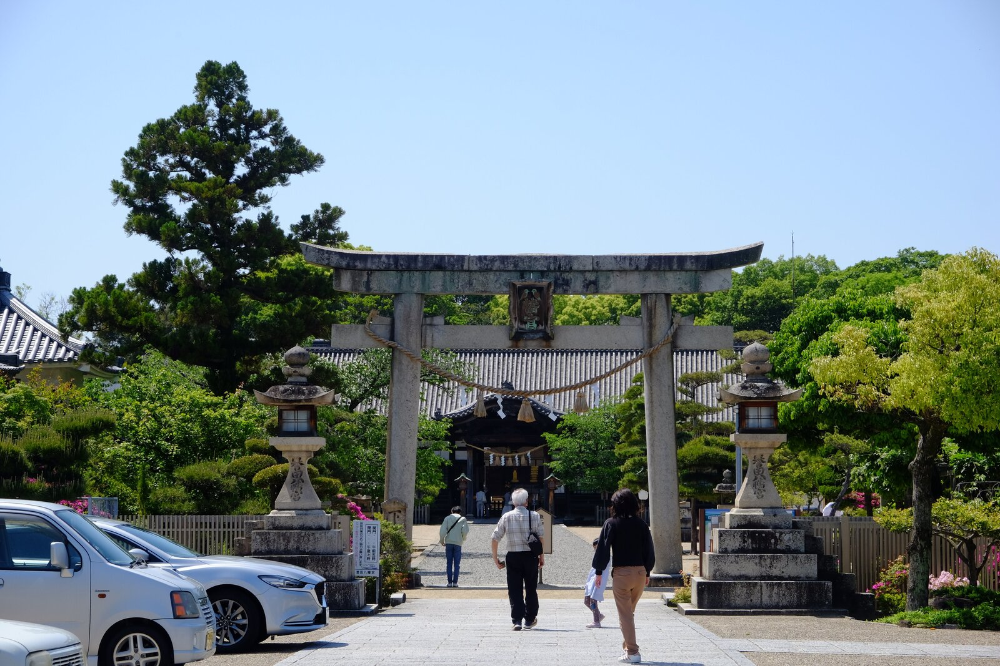
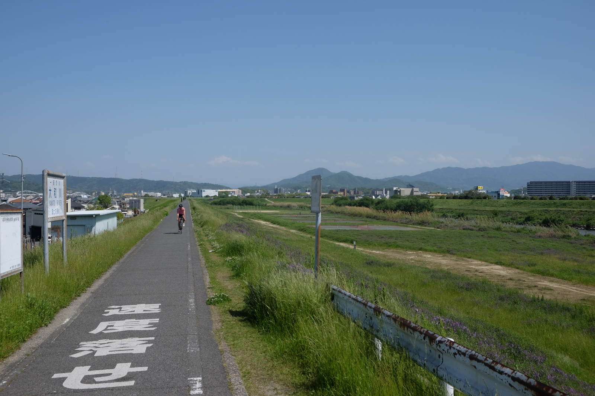

---
categories:
  - bike
  - cycle path
date: "2025-08-01T23:44:08+09:00"
description: Discover an enchanting cycling course on Osaka's Minamikawachi Cycle Line, transforming your return journey into a captivating exploration of historic townscapes like Tondabayashi Jinaimachi and ancient wonders like the Furuichi Kofun Group.
draft: false
featured_image: "images/0041.jpg"
summary: On the return trip of the Minamikawachi Cycle Line, I transformed a simple ride back into a historical adventure, making delightful detours to explore the charming old townscape of Tondabayashi Jinaimachi and the majestic ancient tombs of the Furuichi Kofun Group, including Hōnda Gobyōyama Kofun.
tags:
  - Cycling
  - Pottering
  - Road Bike
  - Madone2.1
  - Osaka
  - Minamikawachi Cycle Line
  - Cycling Road
  - Jinaimachi
  - Kofun
keywords: "Cycling, Pottering, Road Bike, Madone2.1, Osaka, Minamikawachi Cycle Line, Cycling Road, Jinaimachi, Kofun"
js: js/mbox.ts
title: Minamikawachi Cycle Line - Your Return Journey Through History and Scenery!
---

Having conquered Osaka Prefecture's Minamikawachi Cycle Line from the vibrant Taisho Bridge to its endpoint, I decided to elevate the return journey from a mere backtrack to an unforgettable adventure! Instead of retracing my exact steps, I wove through time and beauty, making delightful detours to explore the charming old townscape of Tondabayashi Jinaimachi and the majestic ancient tombs of the Furuichi Kofun Group, including the grand Hōnda Gobyōyama Kofun, all on my way back to Taisho Bridge. Get ready to discover hidden gems and historical wonders on two wheels!

## Your Scenic Route: A Blend of Cycling and Discovery!

{{< mbox json="track.json" center="{ \"lng\": 135.597226, \"lat\": 34.522955 }" zoom="10" style="" >}}

Your journey kicks off at the Minamikawachi Cycle Line's endpoint, where National Route 170 meets National Route 310. But here's where the adventure truly begins! Instead of just rejoining the cycle line, we'll venture straight through this intersection, then take a charming right onto a narrow road that leads you directly into the captivating heart of Tondabayashi Jinaimachi.

After immersing yourself in the timeless ambiance of Jinaimachi, you'll cross the impressive Kongo Ohashi Bridge to gracefully rejoin the Minamikawachi Cycle Line for the majority of your return. As you approach the Nishimeihan Expressway, prepare for another exciting detour: head west to explore several fascinating kofun (ancient burial mounds) of the Furuichi Kofun Group, each with its own story, before finally returning to the Minamikawachi Cycle Line's original starting point.

## From Cycle Line's End to the Historic Charms of Jinaimachi!

My previous ride saw me conquer the Minamikawachi Cycle Line from its lively start at Taisho Bridge to its end. For the return, I yearned for something more than just a repeat. That's when I set my sights on Tondabayashi Jinaimachi, a true hidden gem brimming with beautifully preserved old townscapes – a perfect next stop for my cycling exploration!

You'll pedal north along National Route 170, a straightforward stretch that builds anticipation for what's ahead. While the Minamikawachi Cycle Line typically veers left here towards National Route 309, you'll continue straight north. Then, with a turn right around Henan Prefectural High School, a narrow road will guide you into the evocative, atmospheric streets that signal your arrival in Jinaimachi – prepare to be charmed!

Behold the Former Sugiyama Residence, a designated Important Cultural Property! Though its doors are usually open to the public, my Golden Week visit found them temporarily closed.

Imagine yourself gliding through this nostalgic town, each pedal stroke a journey back in time.

To your left, your eyes will be drawn to the distinctly tall bell tower and drum tower of Tondabayashi Koshōji Betsuin, towering over the town. This magnificent temple is truly the historical core around which Tondabayashi Jinaimachi beautifully unfolded.

Even the grand main gate at the entrance holds a secret: it's said to have been relocated directly from Fushimi Momoyama Castle!

While there are many other fascinating sights to uncover, I, with my limited prior knowledge, was utterly captivated by the sheer beauty of the old townscape. Feeling thoroughly satisfied, I continued my journey, leaving Jinaimachi behind for now.

Who knew such a wonderfully preserved, almost cinematic, old townscape existed right here in Osaka? It's like stepping onto a movie set!

## Rejoining the Flow: Back on the Minamikawachi Cycle Line!

Exiting Jinaimachi to the east, you'll swiftly reach the impressive Kongo Ohashi Bridge. The Minamikawachi Cycle Line awaits you on the left bank of the Ishikawa River, so simply cross the bridge to continue your adventure.

After crossing the bridge and turning left, I scouted for the perfect entry point from the roadway back onto the Minamikawachi Cycle Line. There it was: a break in the fence, allowing seamless access to the pedestrian path. From this very spot, you can effortlessly descend to the tranquil riverside path.

On my return journey, I was delighted to once again glide across the magnificent Ishikawa Cycle Bridge. This iconic spot truly is an unmissable highlight of the route!

Just a short ride north from the Ishikawa Cycle Bridge, near the Kamoi Weir, I stumbled upon a delightful little plaza complete with a cycle stand and tables – a perfect, inviting spot! I hadn't noticed it on my outbound journey, but I happily took the opportunity to park my bike and soak in the peaceful surroundings with a refreshing break.

Gazing beyond the Kamoi Weir, I wondered if those majestic peaks were Mount Yamato Katsuragi (to the left) and Mount Kongo (to the right) – a truly picturesque vista!

From this point, it was a pure, exhilarating ride back along the Minamikawachi Cycle Line. As I neared the end of the Ishikawa River section, just before the Nishimeihan Expressway, a gently rising, verdant hill emerged into view. This was the impressive Hōnda Gobyōyama Kofun (Emperor Ōjin's Mausoleum), the largest and most captivating kofun within the Furuichi Kofun Group.

## Unearthing History: Exploring the Furuichi Kofun Group!

From the Minamikawachi Cycle Line, I veered west, my sights set firmly on the Hōnda Gobyōyama Kofun. That distinct hill in the back right stood out against the flat landscape, ensuring I wouldn't lose my way – a clear path to ancient wonders!

Just before reaching the kofun, another atmospheric road revealed itself. To my right, I discovered the serene Hōnda Hachimangū Shrine.

The shrine grounds were bustling with vibrant activity and many visitors! The ancient forest behind it is none other than the Hōnda Gobyōyama Kofun (Emperor Ōjin's Mausoleum), and it's here that the shrine reveres Emperor Ōjin as its principal deity.

Though I approached Hōnda Gobyōyama Kofun from its south side, the "entrance" (if you can call it that!) to the kofun itself lies on the north. This meant navigating a delightful, albeit convoluted, maze of narrow roads.

My quest took me through unexpected detours: I was blocked by farm roads marked "No Entry for Unauthorized Personnel" and even found myself on unpaved paths. In the end, I reached National Route 170, making me realize it might have been simpler just to stick to the main road from the start!

Finally, after a bit of meandering, I reached the entrance! It seems the entrances to an ancient burial mound (kofun) managed by the Imperial Household Agency always have this understated, almost secretive, charm.

A solemn torii gate stands proudly at the very edge of the "front," square section of this magnificent keyhole-shaped tumulus, offering a glimpse into its ancient grandeur.

And, as is often the case with these majestic kofun, there wasn't a soul in sight! Well, there's not much else to see up close, and from below, the true shape of the kofun remains a mystery.

I had parked my bicycle in the open space directly across the road from the kofun entrance, only to discover that this very spot was itself a kofun – the Ōtorizuka Kofun! History truly is everywhere here.

And immediately to its north lies Komuroyama Kofun, a truly unique site because you can actually *enter* it! I yearned to climb to its summit, but with my cycling cleats, it seemed a bit cumbersome, so I simply admired it from below this time. And yes, once again, I had this ancient wonder all to myself!

Just north of Komuroyama Kofun stands Nakatsuyama Kofun, believed to be the mausoleum of Empress Nakatsuhime-no-mikoto, Emperor Ōjin's consort. Like Hōnda Gobyōyama Kofun, it's meticulously managed. And here, to my delight, I finally encountered another person visiting a kofun!

Here's the classic front-on shot of a kofun. While it's a bit smaller than the grand Hōnda Gobyōyama Kofun, it shares the same awe-inspiring pattern.

## Mission Accomplished: Back at the Minamikawachi Cycle Line Starting Point!

This fascinating area, known as the Furuichi Kofun Group, is absolutely teeming with ancient burial mounds, but having had my fill of historical exploration, it was time to rejoin the Minamikawachi Cycle Line! I connected with the Yamato River path and put in a final burst of energy, sprinting towards the cycle line's starting point.

And just like that, I was back at the Taisho Bridge starting point, bringing this incredible cycling journey to a triumphant close!

The path was alive with activity, as countless cyclists and runners whizzed by, one after another. This truly is Osaka's top recommended bicycle path – it's a blast to ride, and the opportunities for spontaneous sightseeing detours make it an utterly unforgettable experience!

## Summary

The Minamikawachi Cycle Line (with the exception of the national highway section near the endpoint) is a wonderfully maintained and visually stunning bicycle path that promises an exhilarating ride. Beyond the main route, the charming detours offer incredible value. I wholeheartedly recommend taking the time to explore the captivating Tondabayashi Jinaimachi and the majestic Furuichi Kofun Group – they are truly sights to behold!
