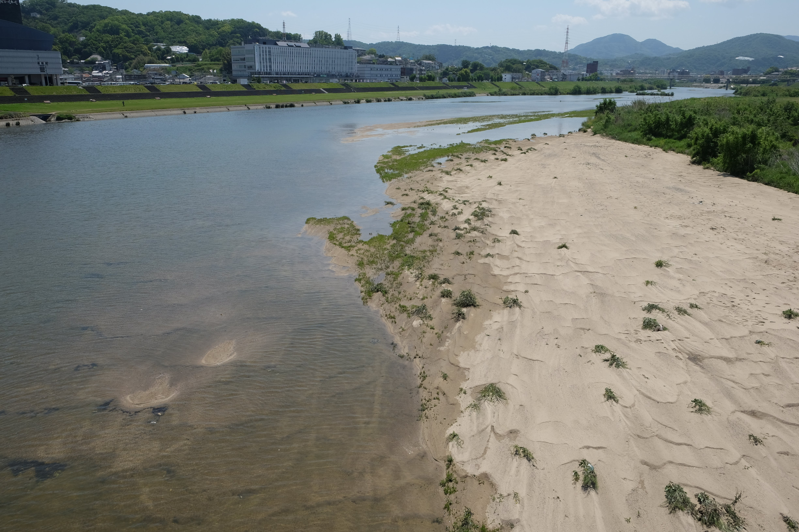
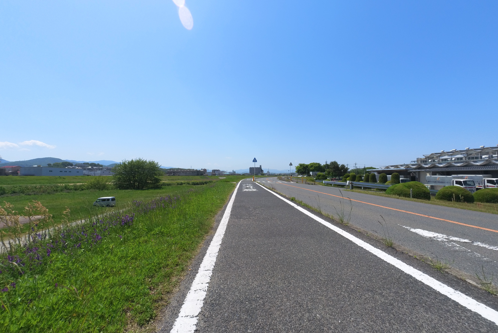
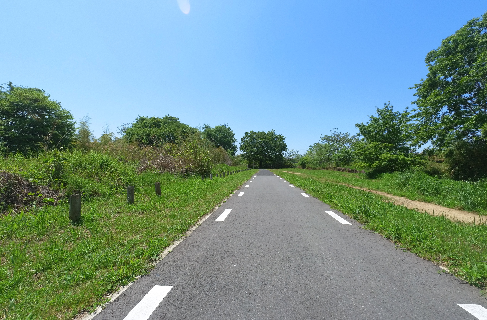

---
categories:
  - bike
  - cycle path
date: "2025-02-15T23:44:06+09:00"
description: "Discover Osaka's Minamikawachi Cycle Line! Cycle 21.1km of scenic riverside paths and explore local culture. Enjoy well-maintained routes, iconic bridges, and convenient access. Perfect for an exhilarating ride in Osaka, Japan."
draft: false
featured_image: "images/0015-1.jpg"
summary: 
tags:
  - cycling
  - pottering
  - road bike
  - Madone2.1
  - Osaka
  - Minamikawachi Cycle line
  - Cycle line
keywords: "cycling, pottering, road bike, Madone2.1, Osaka, Minamikawachi Cycle line, Cycle line"
js: js/mbox.ts
title: Explore Osaka's Scenic Minamikawachi Cycle Line! - Outward Journey
---

Are you looking for an exhilarating cycling adventure in Japan? Discover the Minamikawachi Cycle Line, a cycling path in Osaka Prefecture, offering a refreshing escape with picturesque riverside views!

## What is the Minamikawachi Cycle Line?

The Minamikawachi Cycle Line is one of Osaka Prefecture's grand cycling routes, stretching a delightful 21.1 km. While Osaka boasts other popular routes like the Kitakawachi Cycle Line, Kitaosaka Cycle Line, and Naniwa Cycle Road, the Minamikawachi Cycle Line offers a unique charm, particularly along its beautiful riverside sections.

## The Journey: A Route to Remember

{{< mbox json="track.json" center="{ \"lng\": 135.597226, \"lat\": 34.522955 }" zoom="10" style="" >}}

Your adventure begins at Taisho Bridge, spanning the Yamato River. As you cycle upstream with the Yamato River gracefully flowing on your right, you'll soon merge with the Ishikawa River. The route along the Ishikawa River is truly a highlight, leading you to the iconic Ishikawa Cycle Bridge – a magnificent structure and a true symbol of the Minamikawachi Cycle Line.

While a portion of the route later joins a national highway, the initial riverside stretch promises a wonderfully smooth and enjoyable ride.

## Getting There: Your Gateway to Adventure

The starting point at Taisho Bridge can not be very easily accessed. If you're driving, look for nearby coin parking. For those arriving by train, "Yao-Minami Station" (subway Tanimachi Line) or "Fujiidera Station" (Kintetsu Minami Osaka Line) may be convenient.

## Embarking from Taisho Bridge

After taking a moment to find parking, reaching Taisho Bridge marks the exciting beginning of your ride! You'll spot a sign indicating the start of the "Yao-Kawachinagano Cycling Road," another name for the Minamikawachi Cycle Line. 

You might even find a map here, though almost everything on the board is a faded!.

On a clear, sunny day in May, the conditions are absolutely perfect for cycling. Feel the exhilaration as you pedal forward, surrounded by the vibrant purple blossoms of the Kusafuji plant, dotting the riverside. 

The path is fairly smooth, with only two road crossings where you'll briefly join vehicle traffic. 

Keep an eye out for the majestic Mt. Ikoma appearing on your left, and notice the distance markers on the ground, charting your progress.

You might even encounter a rare sight for a cycling path – a railroad crossing! Just to the left of the crossing is Kashiwara Minamiguchi Station, and if you're lucky, you might see a train departing, adding to the charm of your ride.

## Crossing the Shin-Yamato Bridge and Following the Ishikawa River

Soon after crossing the railway, you'll see the Shin-Yamato Bridge. This bridge, designed exclusively for cyclists and pedestrians, is a landmark of the Minamikawachi Cycle Line. From the Shin-Yamato Bridge, you'll enjoy a splendid view of the Yamato River upstream.

Beyond the Shin-Yamato Bridge lies the confluence of the Yamato and Ishikawa Rivers. Here, the path curves right, leading you along the Ishikawa River. The route gracefully meanders, sometimes bringing you closer to the river, and then gently rising away, creating a dynamic and engaging ride. 

You'll find a rough map at a U-turn point, offering a general overview of the route.

Unlike some other cycling paths, the Minamikawachi Cycle Line is notably free of cumbersome bike barriers, making for an incredibly fluid and enjoyable experience. What's more, you'll find several restrooms placed along the Ishikawa River section – a welcome convenience for any long-distance cyclist!

## The Ishikawa Cycle Bridge: A True Landmark

As you continue, a grand bridge will come into view – the Ishikawa Cycle Bridge, the true icon of the Minamikawachi Cycle Line. 

Photos don't do it justice; its actual size and impressive length for a cycling bridge are truly striking. 

As you cross, take a moment to admire the upstream view, the direction you're headed.

After crossing, remember to turn left and descend a slope, making a U-turn to rejoin the riverside path upstream – it's easy to go right here mistakenly !

In early May, you might be treated to a delightful sight of carp streamers (Koinobori) fluttering in the riverbed, perfect for a quick photo stop.

## Transition to the Road and the Final Stretch

A short distance from the Ishikawa Cycle Bridge, the riverside path transitions to the road. You'll turn right at the Kawanishi Ohashi Bridge, heading west on National Route 309 towards National Route 170.

The final leg of the journey takes on a more "stoic" character as you cycle alongside cars on the national highway. 

There's even a significant uphill climb – the most challenging elevation gain on the route. 

The Minamikawachi Cycle Line concludes at an ordinary intersection with National Route 310, underneath an elevated section of National Route 170. It might not be the most dramatic finish, but a small sign marks your achievement!

## Extend Your Adventure: Explore Local Culture

If you're traveling by car, consider a delightful detour on your way back! Explore the charming historic townscape of Tondabayashi Jinaimachi or the ancient Kofun (tumuli) of the Furuichi Kofun Group, including the majestic Konda Gobyoyama Kofun. These cultural gems offer a fascinating glimpse into Japan's rich history.

## In Summary: A Rewarding Ride

While the Minamikawachi Cycle Line's start and end points may lack grand landmarks, the riverside sections are truly a joy to ride. The path is well-maintained, with convenient restrooms and minimal obstructive bike barriers, making it one of Osaka's most cyclist-friendly routes. The Ishikawa Cycle Bridge adds a captivating highlight, ensuring an engaging experience throughout. Although the later section on the national highway might feel less scenic, the overall ride is gratifying. For future rides, consider enjoying only the riverside section as a round trip!

We hope this creative translation inspires you to discover the beauty of cycling in Osaka!
