<!-- 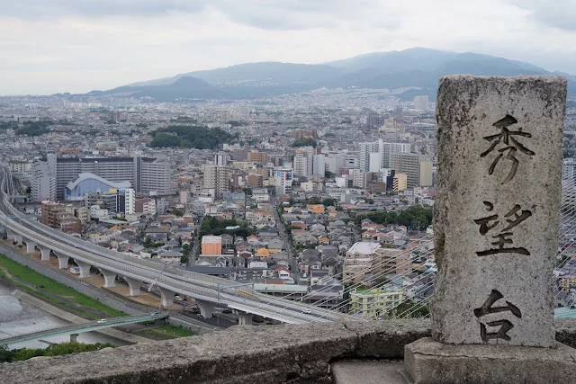 -->

A famous hill climb cycling route in Osaka, Japan. Satsukiyama hill climb route starts from the entrance of Satsukiyama driveway. This route is 6.5km long and has an elevation gain of 448m. You can see the landscape of Mt. Rokkou and the cities under the mountain at the end of the route. 

## Route

<iframe allowtransparency="true" frameborder="0" height="405" loading="lazy" scrolling="no" src="https://www.strava.com/activities/4112916799/embed/28ae7b979f315fd40ec6d1c0d3b0480ac17b7c1b" width="590">
</iframe>

This time I started at Max-Value supermarket then made a circuit including Satsukiyama hill climb. The total distance was 25.7km, elevation gain of 660m.

## Max-Value supermarcket to the entrance of Satsukiyama driveway

One autumn afternoon, I came up with an idea to go cycling to Satsukiyama hill climb, a famous hill climb cycling route in Osaka I have never visited. I cycled to Max-Value supermarket then decided this place to start.

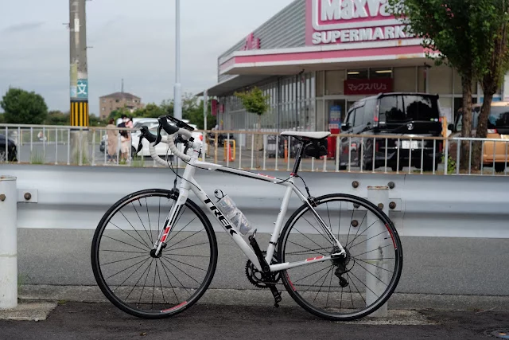

If you drive a car to carry your bike, it is not recommended to park at the supermarket. Kitasenri park will be a good choice to park at.

Going west for a while, I got to Minoo station.

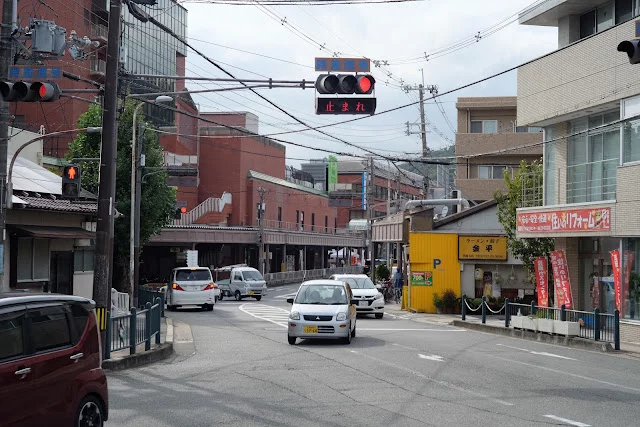

Then got to Satsukiyama park. This park has a tiny zoo where many people visit on holidays.

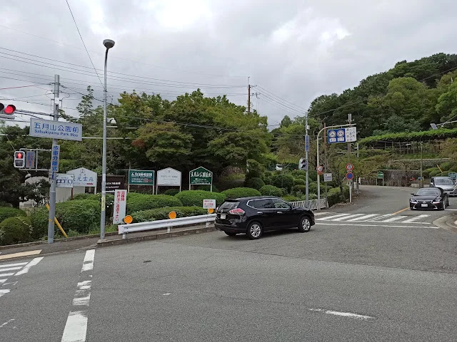

## Satsukiyama hill climb

Climbing a little bit after the Satsukiyama park, there is a toll gate on the road. Don't worry. You can pass free by bike.

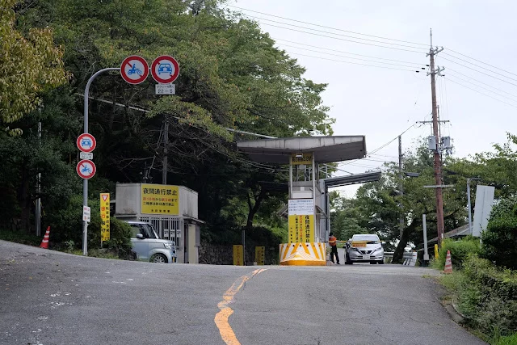

As soon as passing the gate, a steep hill appeared then I gave up and got off the bike. It was too hard for me.

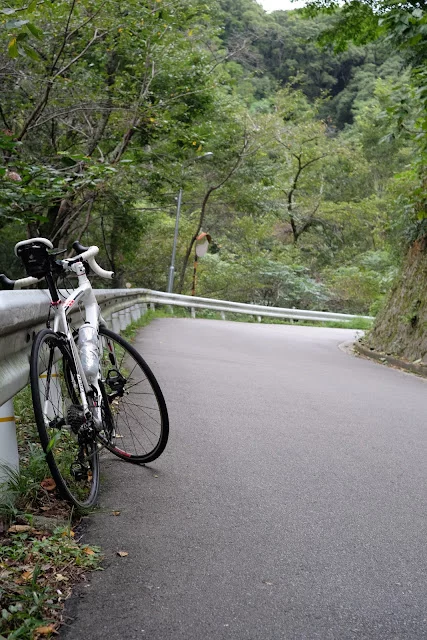

I continue riding and walking for a while. The goal of Satsukiyama hill climb, Syūbōdai, is not so far since the distance is only 6.5km.

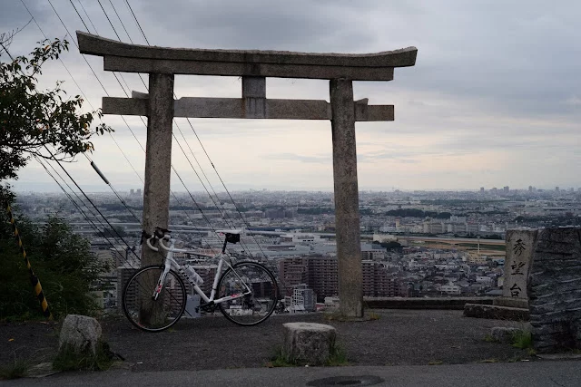

The cities and a river spread below my eyes. 

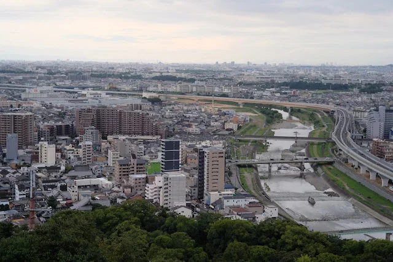

Mt. Rokko behind the city.

## Minō dam

Although the Satsukiyama hill climb ends here, I continued going uphill to Minō dam. The route to Minō dam was not so interesting. I just passed a cemetery and a golf field without any delightful outlook.

I arrived at Minō dam when it started rain. I just stopped to take a look at the dam shortly.

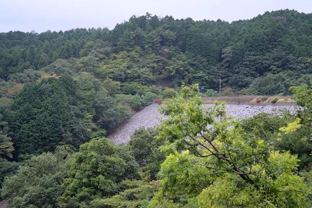

I had to downhill slowly since the road got slippy.

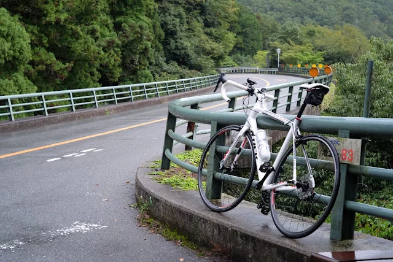

## Temple Katsuoji

Temple Katsuoji is only a landmark to see after Syūbōdai.

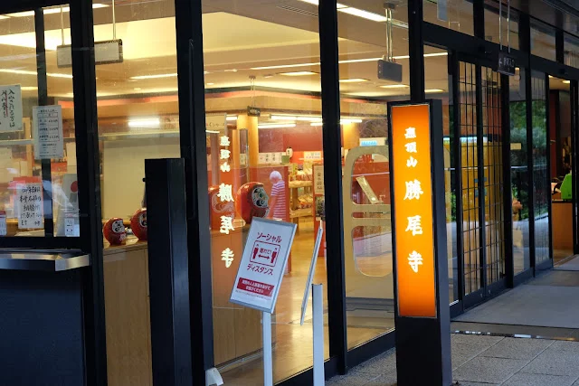

I didn't enter the temple this time and just took a photo outside. Katsuoji is famous with darma, red-painted tumbling doll.

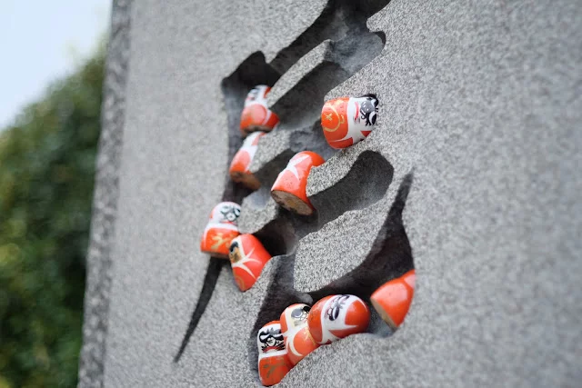

If you go there in June, you can see prenty of hydrangeas bloom in the temple.

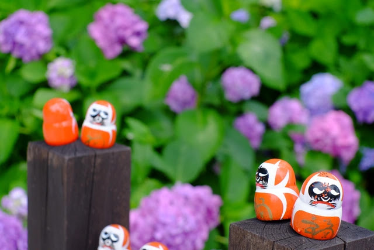

## Goal

After continuing downhill in the rain, I returned to the Max-Value when it stopped rain.

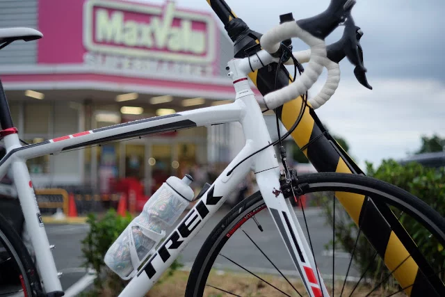

## Overall

Satsukiyama hill climb was a hard hill climb route. However steep hill climb was only at the beginning of the route. The view from Syūbōdai was good and temple Katsuoji is an interesting temple to see daruma.

